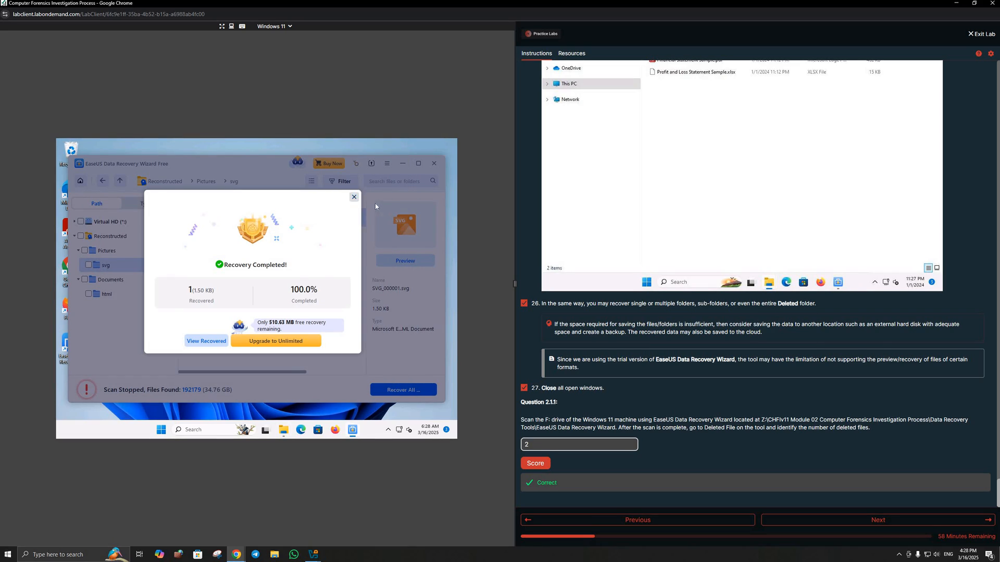
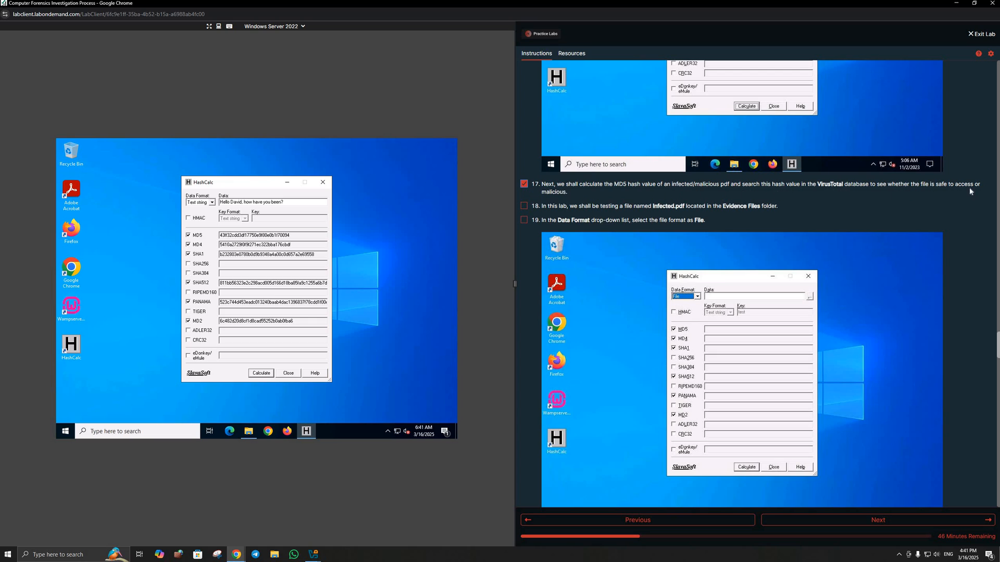
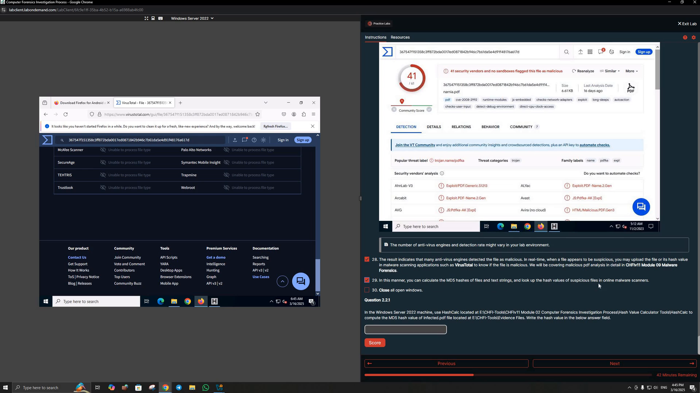
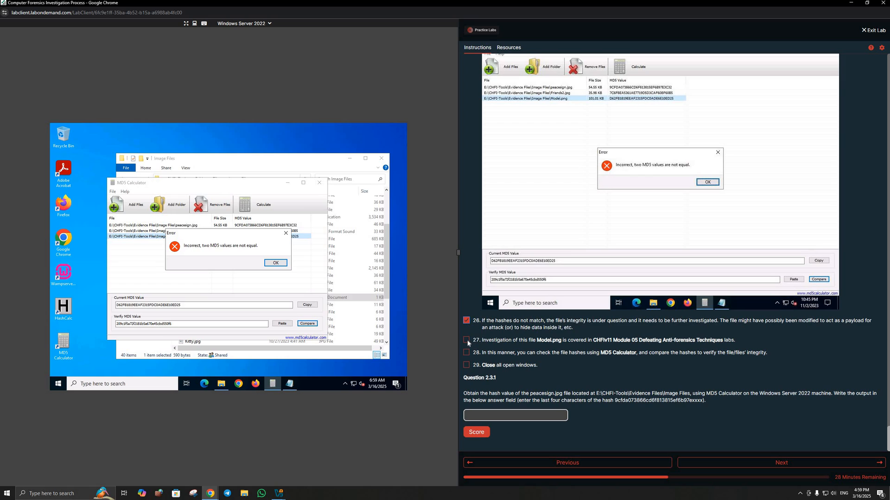
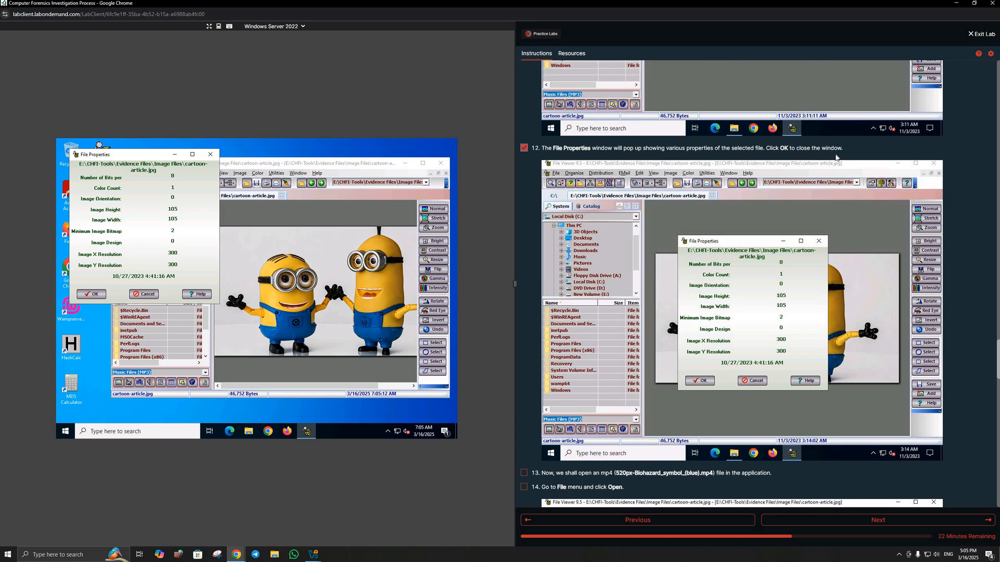
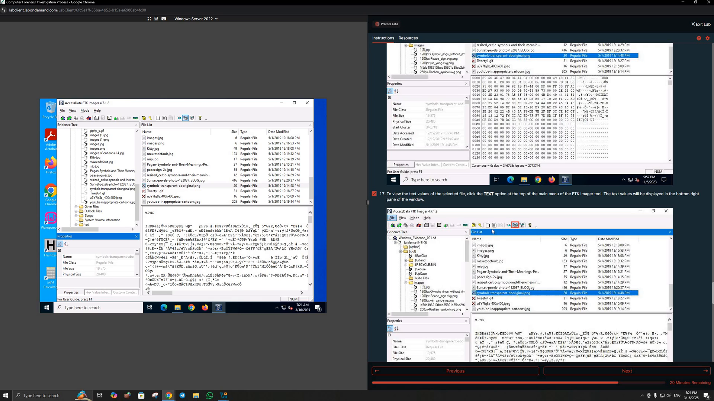
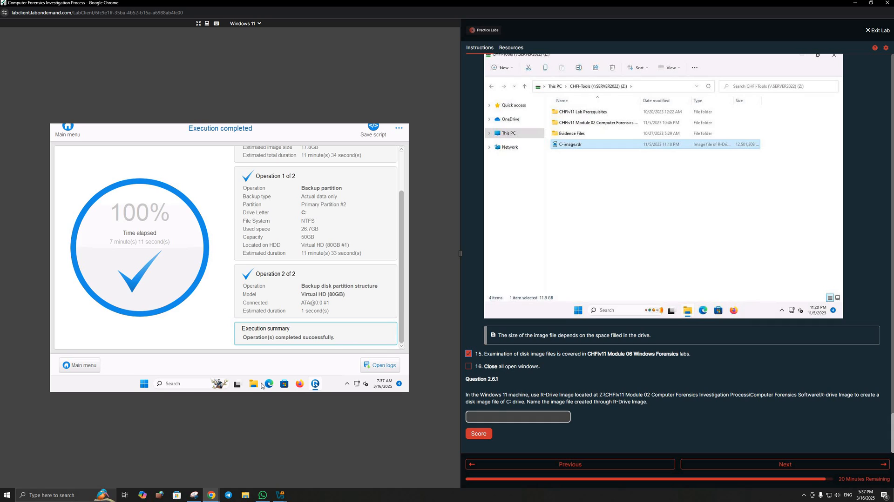

# Computer Forensics Investigation Process — Lab Walkthrough

> **Environment:** Authorized academic lab  
> **Module:** Computer Forensics Investigation Process  
> **Purpose:** Educational digital-forensics practice

This walkthrough documents the work visible in my recorded lab session. It follows the six lab sections shown in the training environment and focuses on the practical steps, tools, and results demonstrated in the recording.

---

## Lab 1 — Recover Data from a Windows Hard Disk

The first lab focused on recovering deleted data from a Windows hard disk using **EaseUS Data Recovery Wizard**.

I scanned the lab's forensic disk, reviewed the recoverable data, navigated through deleted/reconstructed content, and recovered a selected file.

### What I practiced

- Scanning a disk for deleted and recoverable data
- Navigating recovered file structures
- Previewing recoverable content
- Recovering selected files
- Understanding that deleted data may still be recoverable

---

## Lab 2 — Perform Hash or HMAC Calculations

The second lab focused on computing hashes using **HashCalc**.

I used HashCalc with both text and file input and generated hash values using the algorithms selected in the lab.

The lab then used the hash of a lab-provided suspicious PDF with **VirusTotal** to check whether security engines identified the file as malicious.

### What I practiced

- Generating hash values from text and files
- Working with multiple hashing algorithms in HashCalc
- Using a file hash as an investigation artifact
- Checking a suspicious-file hash with VirusTotal
- Interpreting multi-engine detection results

---

## Lab 3 — Compare Hash Values of Files to Check their Integrity

The third lab focused on integrity checking with **MD5 Calculator**.

I calculated MD5 values for evidence files and compared the current hash against a provided/reference value.

During the exercise, one comparison produced a mismatch, showing that the two MD5 values were not equal and that the file required further investigation.

### What I practiced

- Calculating MD5 values for evidence files
- Comparing current and reference hashes
- Identifying a hash mismatch
- Using hashes as part of an evidence-integrity check

---

## Lab 4 — View Files of Various Formats

The fourth lab used **File Viewer 9.5** to examine files in different formats.

I opened evidence files, viewed their content, and reviewed file properties such as image dimensions and resolution.

### What I practiced

- Opening and examining files of different formats
- Reviewing file properties
- Inspecting file content during forensic examination
- Using a dedicated viewer instead of relying only on file extensions

---

## Lab 5 — Handle Evidence Data

The fifth lab focused on handling evidence using **AccessData FTK Imager**.

I loaded the provided forensic evidence image, navigated the evidence tree, examined files and their properties, and viewed raw file content using FTK Imager's hex/text views.

The recorded workflow also included exporting a selected file from the evidence image.

### What I practiced

- Loading a forensic evidence image
- Navigating an evidence tree
- Examining file metadata and properties
- Viewing file data in hex/text form
- Exporting a file from forensic evidence

---

## Lab 6 — Create a Disk Image File of a Hard Disk Partition

The final lab focused on disk imaging with **R-Drive Image**.

I selected the lab system's disk/partition, configured an image destination, and allowed the imaging process to run to completion.

The completed operation produced a disk-image file for later forensic use.

### What I practiced

- Selecting a source disk/partition
- Configuring an image destination
- Creating a disk-image copy
- Verifying that the imaging operation completed successfully

---

## Tools Demonstrated in the Recording

| Tool | Use in the lab |
| --- | --- |
| EaseUS Data Recovery Wizard | Recovering deleted data |
| HashCalc | Generating file and text hashes |
| VirusTotal | Checking a suspicious-file hash |
| MD5 Calculator | Comparing MD5 values for integrity |
| File Viewer 9.5 | Viewing files and file properties |
| AccessData FTK Imager | Examining and exporting forensic evidence |
| R-Drive Image | Creating a disk image |

---

## Key Takeaways

This module gave me hands-on exposure to several stages of a basic computer-forensics workflow:

- Recovering deleted information
- Calculating and comparing hashes
- Checking suspicious-file hashes
- Examining files and their properties
- Working with a forensic evidence image
- Inspecting raw file content
- Creating a disk image for forensic analysis
