# Data Acquisition and Duplication — Lab Walkthrough

> **Environment:** Authorized academic lab  
> **Module:** Data Acquisition and Duplication  
> **Purpose:** Educational digital-forensics acquisition and evidence-handling practice

This walkthrough follows the seven lab sections visible in my recorded session. It documents the tools, workflow, observations, and troubleshooting shown in the recording.

---

## Lab 1 — Create a dd Image of a System Drive and Compute an MD5 Hash

The first lab introduced physical disk acquisition using the **dd** utility on Windows.

I first identified the available physical disk using PowerShell so that the correct source device could be referenced during acquisition.

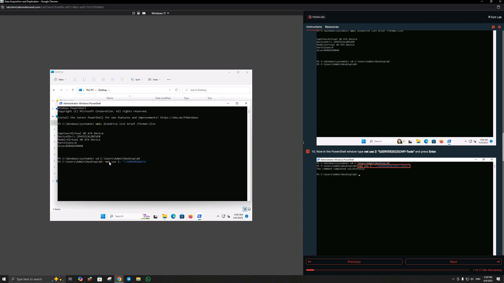

I then prepared the dd acquisition command to copy the selected physical drive into a forensic image file.

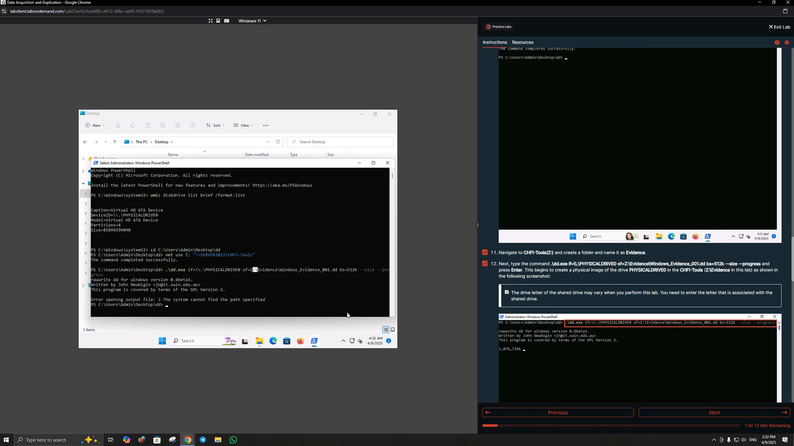

### What I practiced

- Identifying physical disks before acquisition
- Understanding source and destination selection
- Working with dd-style forensic acquisition
- Understanding the role of an MD5 hash in later evidence validation

### Recording note

The recording captures troubleshooting around the output path during the dd command. I therefore treat this section as a documented acquisition workflow and troubleshooting exercise rather than presenting the captured command as a clean successful acquisition.

---

## Lab 2 — Convert an E01 Image to dd Format

The second lab focused on converting an **E01 forensic image** into a raw/dd-compatible form on the Ubuntu Forensics workstation.

The workflow used **xmount**, which can expose an E01 image in a format that other forensic tools can work with.

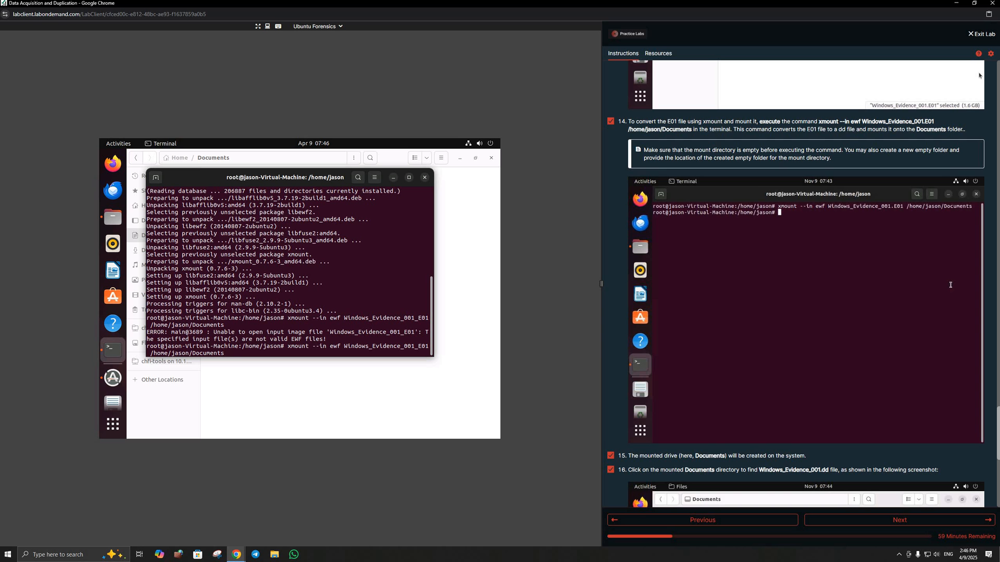

### What I practiced

- Working with E01 forensic image files
- Using xmount in a Linux forensic environment
- Understanding why investigators may need to convert or expose an image in another forensic format
- Troubleshooting file paths and mount locations

---

## Lab 3 — Mount Images on a Linux Forensic Workstation

The third lab continued from the image-conversion workflow and focused on mounting forensic images in Linux.

I mounted a dd image and listed its filesystem contents from the terminal.

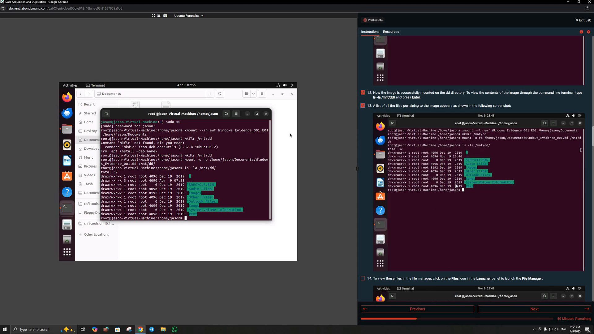

The lab also demonstrated the use of Linux loop devices when working with another disk image.

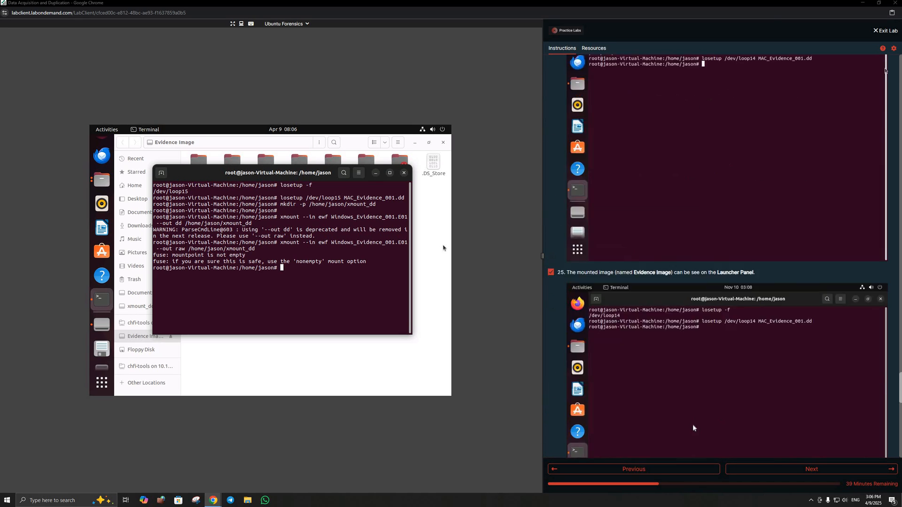

### What I practiced

- Creating a mount point
- Mounting a forensic image
- Listing files inside a mounted image
- Working with Linux loop devices
- Accessing image contents without booting the original system

---

## Lab 4 — Acquire RAM from Windows and Linux Workstations

This section focused on **volatile-memory acquisition**, which is important because RAM can contain evidence that is lost when a system is powered off.

### Windows RAM Acquisition

On Windows, I used **Belkasoft RAM Capturer** and selected an output location for the memory dump.

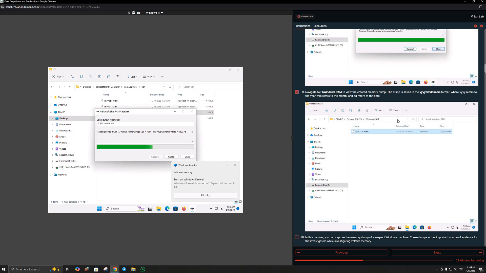

### Linux Memory Acquisition

The Linux portion introduced **LiME** and **fmem** as memory-acquisition approaches.

A memory dump file created during the Linux workflow is visible in the recorded session.

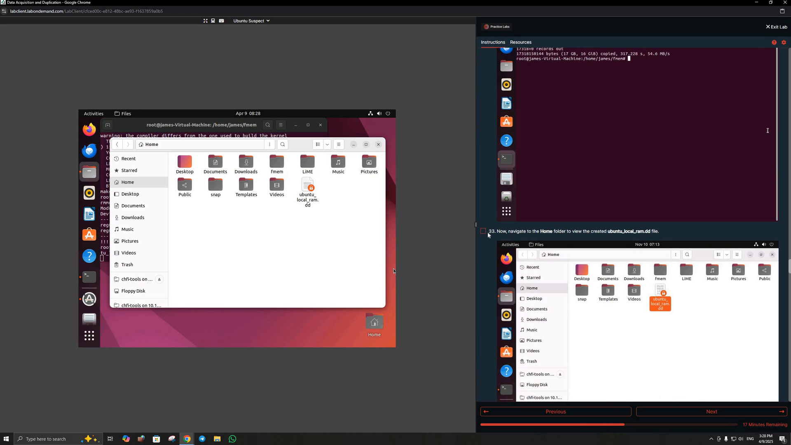

The lab also demonstrated a remote acquisition workflow using **fmem**, `dd`, and **Netcat** to transfer memory data across the controlled lab network.

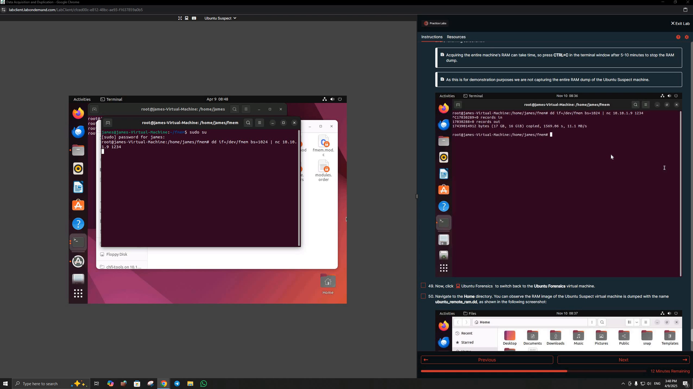

### What I practiced

- Understanding volatile vs. non-volatile evidence
- Capturing Windows memory with a dedicated RAM-acquisition tool
- Linux memory-acquisition concepts with LiME and fmem
- Local vs. remote memory acquisition
- Using network transfer as part of a controlled acquisition workflow

---

## Lab 5 — Create Customized Images from an NTFS Image

The fifth lab used **Runtime's DiskExplorer for NTFS** to examine a forensic image at the partition, sector, and raw-data level.

I opened the image and reviewed the NTFS partition structure.

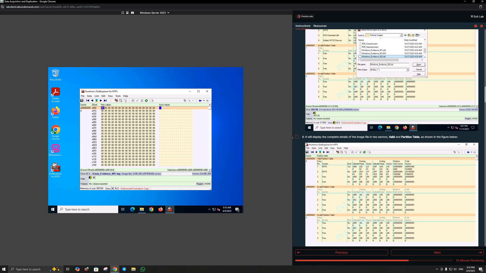

I then navigated directly to selected sector/offset locations and inspected the raw data.

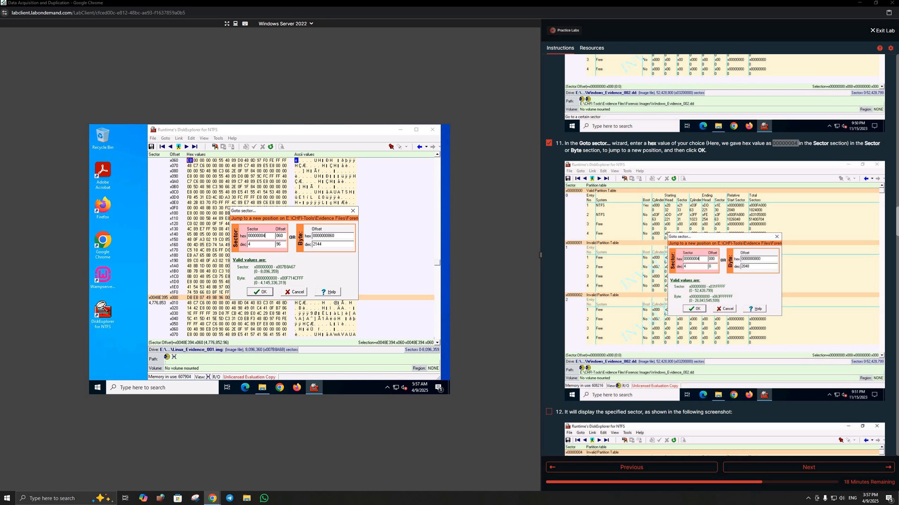

The lab also demonstrated copying a selected range into a separate customized image file.

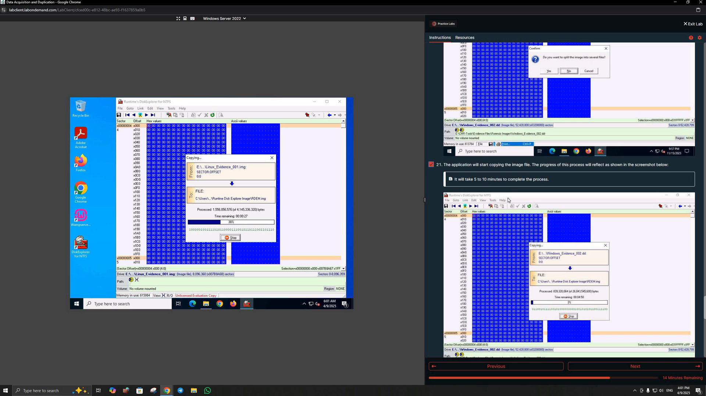

### What I practiced

- Reading NTFS partition information
- Navigating sectors and offsets
- Inspecting raw/hex data
- Selecting a specific region of an evidence image
- Creating a smaller customized forensic image from selected data

---

## Lab 6 — View Contents of a Forensic Image File

The sixth lab used **AccessData FTK Imager** to inspect a forensic image without booting the source system.

I loaded the evidence image and navigated its filesystem through the Evidence Tree.

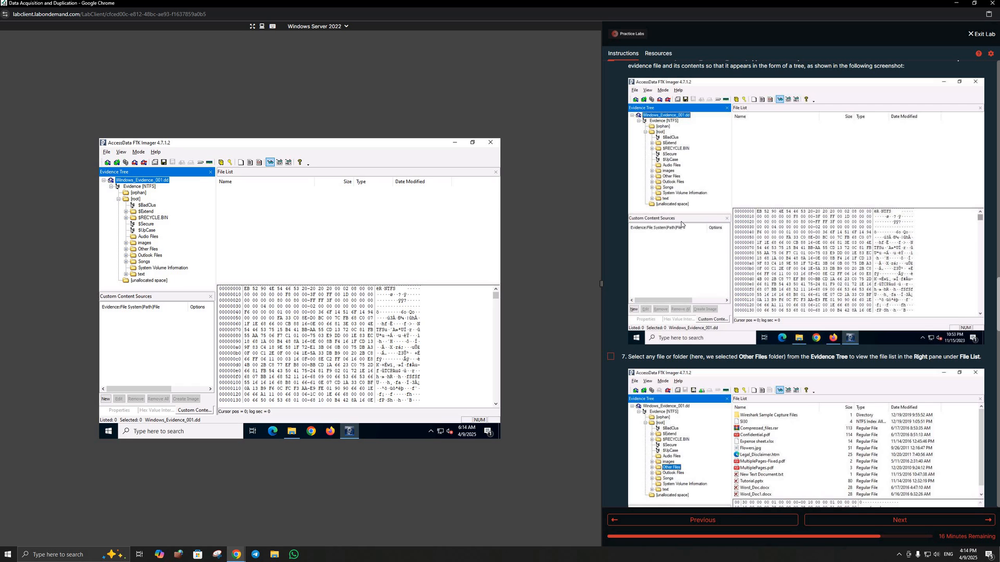

I also examined raw data in FTK Imager's hex view.

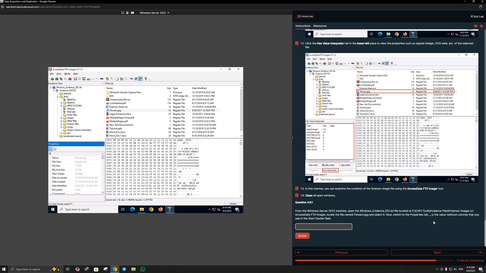

### What I practiced

- Loading forensic evidence into FTK Imager
- Navigating an evidence tree
- Reviewing files and directories inside an image
- Inspecting raw hexadecimal data
- Understanding how forensic tools allow examination of an image while preserving the source

---

## Lab 7 — Access a Disk Image Using PyTSK

The final section introduced **PyTSK3**, a Python interface to The Sleuth Kit, for programmatic access to files and directories inside a disk image.

I prepared the Ubuntu Forensics environment and worked through the PyTSK setup and script workflow.

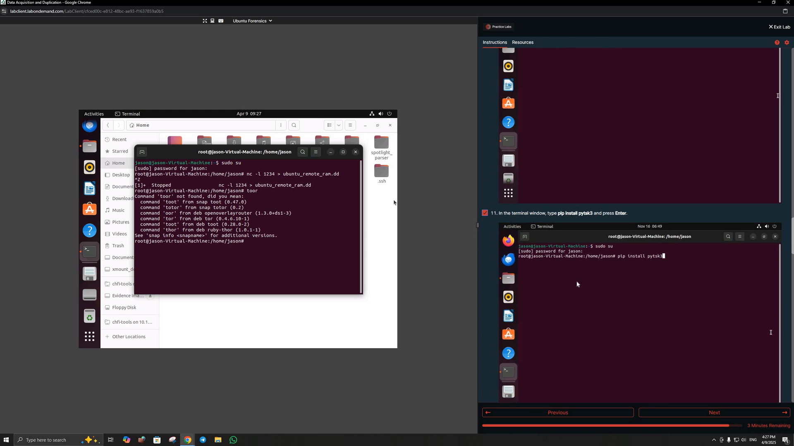

The recording ends with an environment-related Python/pip temporary-directory error during the PyTSK workflow.

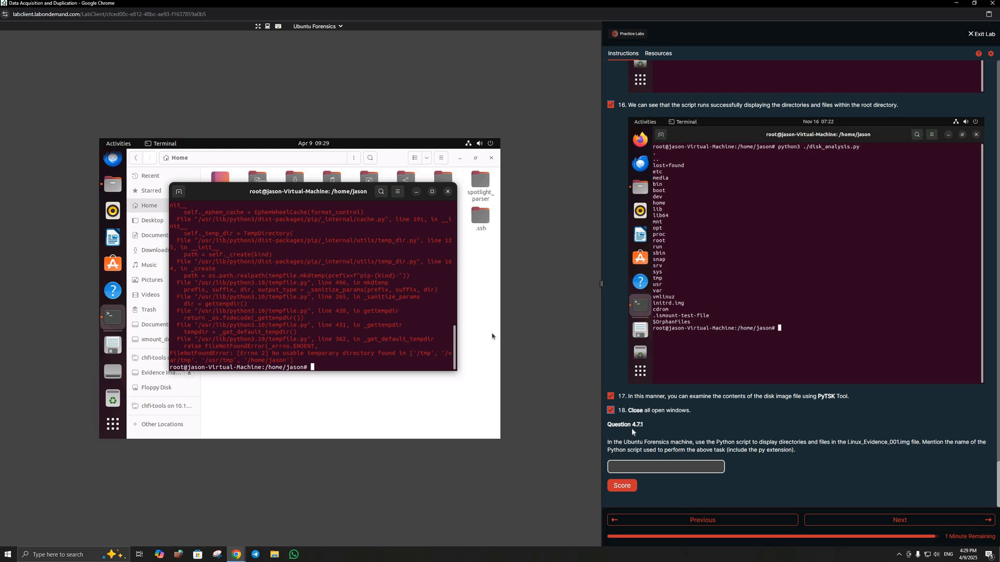

### What I practiced

- Understanding Python-based forensic analysis
- Preparing a PyTSK3 environment
- Working with a disk-analysis script
- Troubleshooting Python/package environment issues during forensic work

### Recording note

I do **not** present the PyTSK portion as a successful final execution because the recorded session ends with an environment error. The workflow and troubleshooting are included because they are part of the actual lab work I performed.

---

## Key Takeaways

This module gave me hands-on exposure to several important stages of forensic acquisition and evidence handling:

- Identifying source storage devices
- Creating and validating forensic-image workflows
- Working with E01 and raw/dd images
- Mounting evidence images in Linux
- Capturing volatile memory
- Examining NTFS structures and raw sectors
- Creating selected/custom image data
- Reviewing images with FTK Imager
- Using Python-based forensic tooling
- Troubleshooting acquisition and forensic-analysis environments
