# Investigating Web Attacks — Lab Walkthrough

> **Environment:** Authorized academic lab  
> **Module:** Investigating Web Attacks  
> **Purpose:** Educational web-attack investigation and forensic log analysis

This walkthrough documents the activities visible in my recorded lab session. The module uses web-server and web-application security logs to identify attack indicators first with **Splunk Enterprise** and then with **Python scripts**.

---

# Lab 1 — Identify and Investigate Web Application Attacks Using Splunk

The first lab used Splunk Enterprise as a SIEM platform to ingest and examine log files generated by Apache, IIS, and ModSecurity.

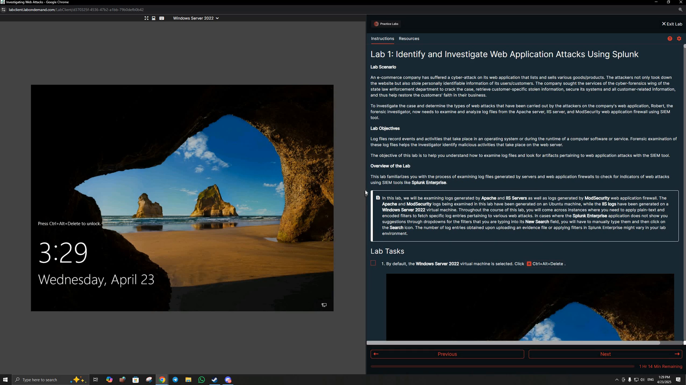

## 1. Cross-Site Scripting (XSS)

I examined XSS-related log entries in Splunk and reviewed HTTP requests containing encoded script-related indicators.

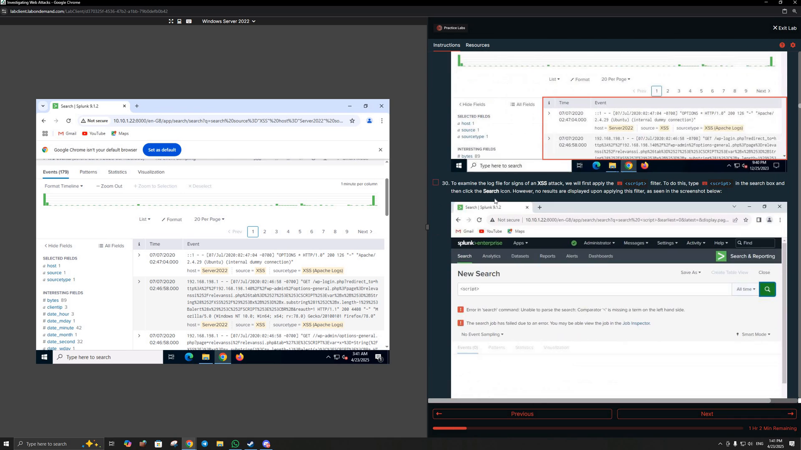

The lab also used **ModSecurity** XSS logs as another source of web-application security evidence.

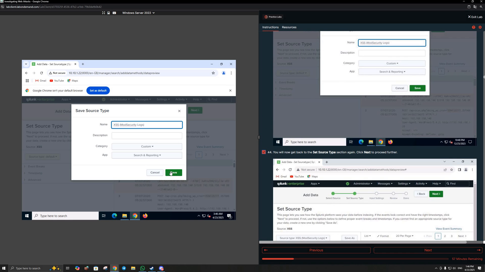

### What I practiced

- Searching XSS-related web logs
- Recognizing encoded payloads in HTTP requests
- Comparing web-server and WAF log sources
- Reviewing timestamps, hosts, requests, and status codes

---

## 2. SQL Injection

I uploaded the provided SQL Injection log into Splunk and configured it for analysis.

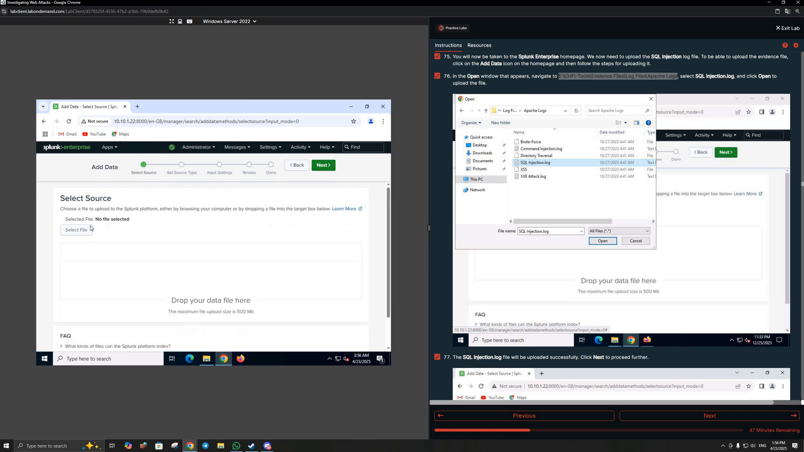

I then searched for SQL Injection indicators. The recorded results include a URL-encoded **UNION SELECT** pattern targeting database metadata.

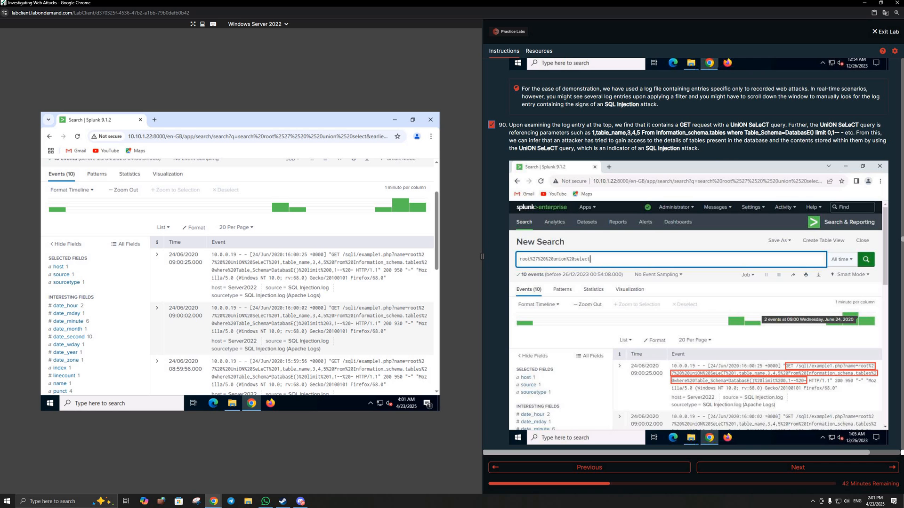

### What I practiced

- Identifying SQL Injection indicators in web logs
- Recognizing URL-encoded SQL syntax
- Reviewing attack source IPs and request paths
- Interpreting how SQL Injection attempts appear in HTTP access logs

---

## 3. Directory / Path Traversal

The next investigation focused on directory-traversal activity.

I searched the logs for traversal patterns such as repeated `../` sequences and reviewed the matching HTTP requests.

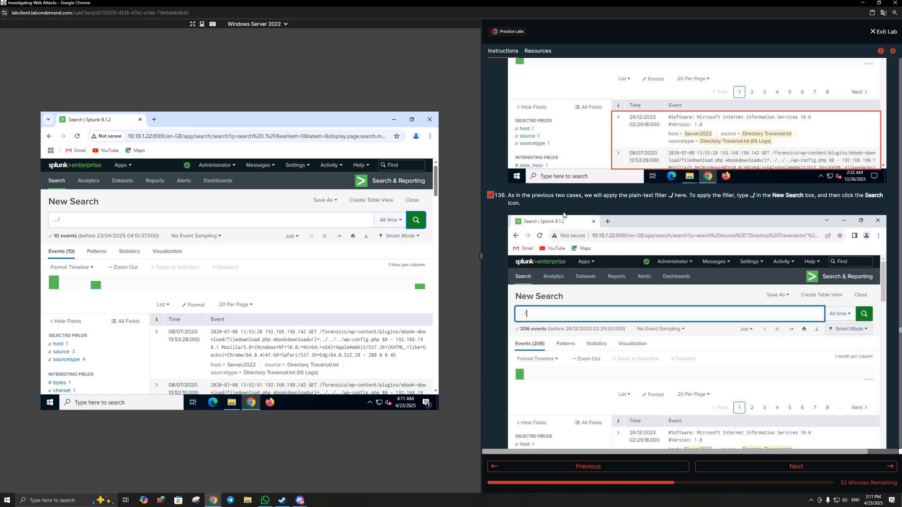

### What I practiced

- Identifying traversal sequences in URLs
- Examining targeted files and application paths
- Using web logs to reconstruct path-traversal attempts

---

## 4. Command Injection

I analyzed the Command Injection log and reviewed suspicious requests containing operating-system command patterns.

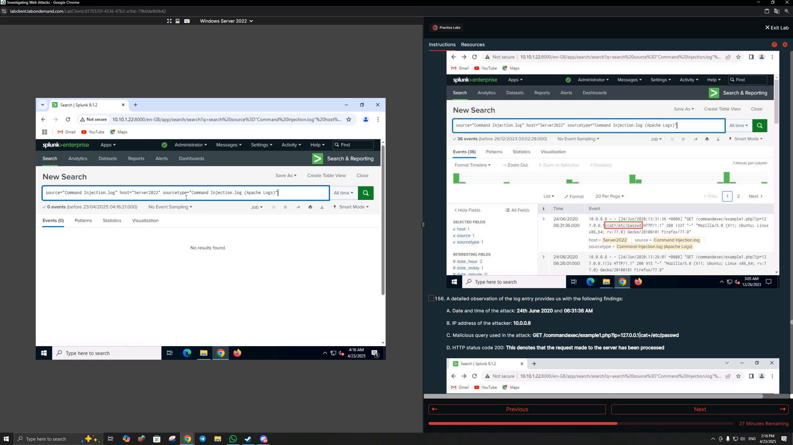

The recorded lab includes a request attempting to reference `/etc/passwd`, which is a clear indicator requiring investigation.

### What I practiced

- Recognizing command-injection patterns
- Reviewing malicious query-string content
- Identifying source IP, timestamp, request, and HTTP response information
- Understanding the forensic value of application access logs

---

## 5. XML External Entity (XXE)

The lab also included an **XXE Attack** log.

I searched the Splunk events for encoded XML/DOCTYPE-related content and reviewed the matching requests.

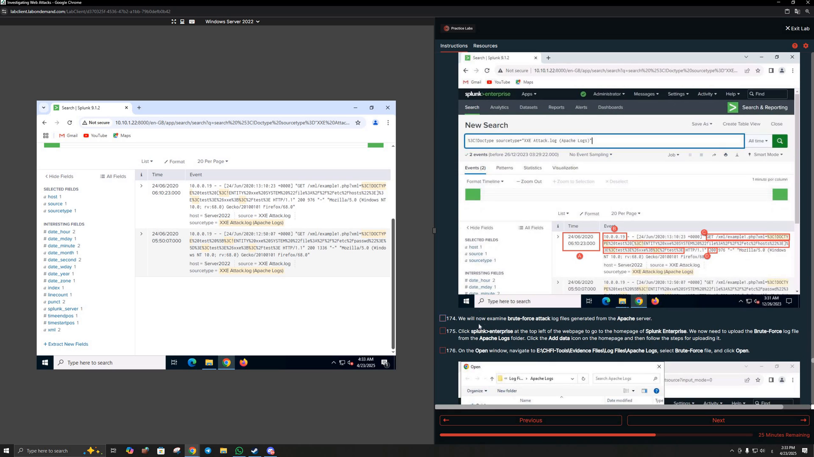

### What I practiced

- Identifying XML and DOCTYPE indicators in web requests
- Reviewing encoded XXE payloads in logs
- Correlating the attacker address with the malicious request

---

## 6. Brute-Force Attack Investigation

The final Splunk section examined a brute-force attack against a WordPress login page.

The uploaded brute-force dataset produced a large group of web events for analysis.

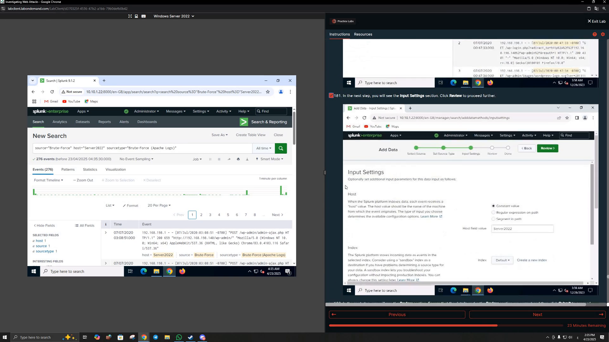

By reviewing repeated requests and later access to an administrative path, the lab demonstrated how log evidence can reveal both repeated login attempts and a subsequent successful access pattern.

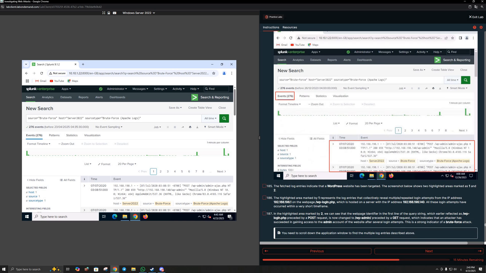

### What I practiced

- Identifying repeated authentication attempts
- Reviewing POST requests to a login endpoint
- Correlating repeated attempts with later administrative access
- Using event volume and request sequences to investigate brute-force activity

---

# Lab 2 — Identify and Investigate Web Application Attacks Using Python

The second lab moved from SIEM searches to **Python-based log parsing** on the Ubuntu Forensics workstation.

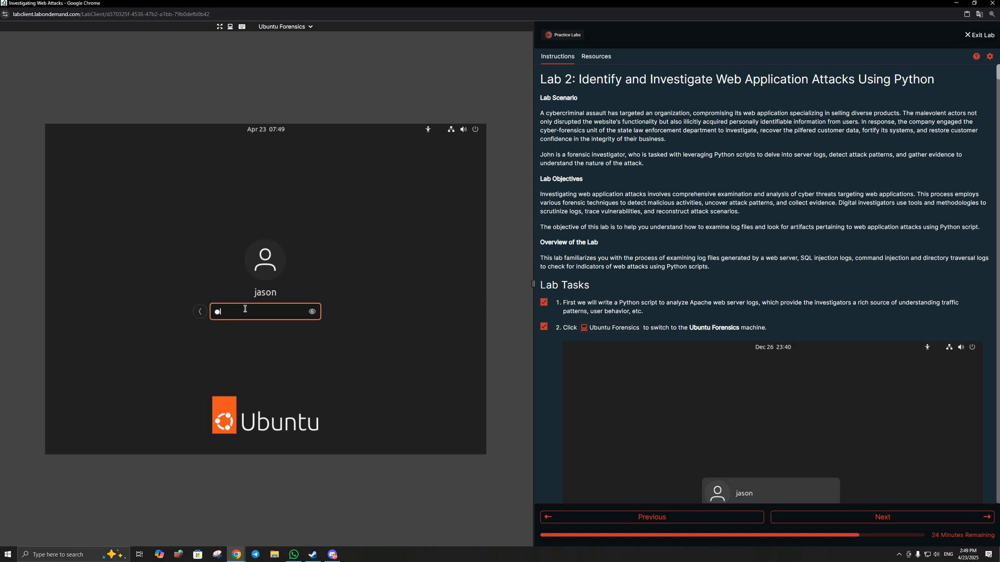

The lab used separate scripts to parse web logs and print entries that matched attack-specific patterns.

---

## 7. SQL Injection Log Parsing with Python

I ran the SQL Injection Python workflow against the provided Apache log and searched the parsed output for the encoded SQL Injection pattern.

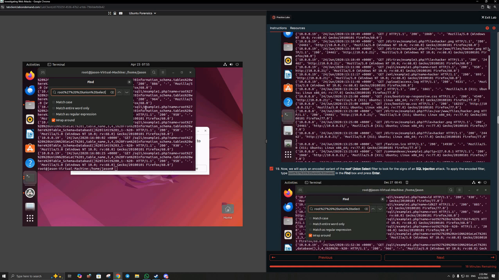

### What I practiced

- Running a Python log-analysis script
- Parsing Apache web logs
- Detecting encoded SQL Injection patterns
- Reviewing matched requests directly from terminal output

---

## 8. Command Injection Log Parsing with Python

I then ran the Command Injection analysis script.

The script identified requests matching command-injection patterns, including the suspicious request targeting `/etc/passwd`.

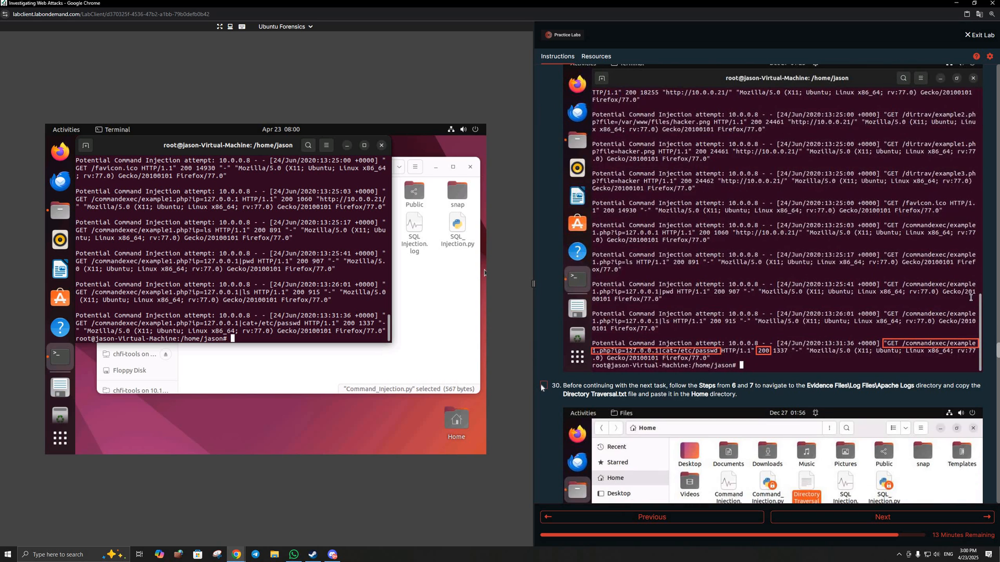

### What I practiced

- Automating attack-pattern detection
- Parsing suspicious HTTP requests with Python
- Reducing a large log file to events requiring investigation

---

## 9. Directory Traversal Log Parsing with Python

The Python workflow was also used to identify directory/path-traversal attempts.

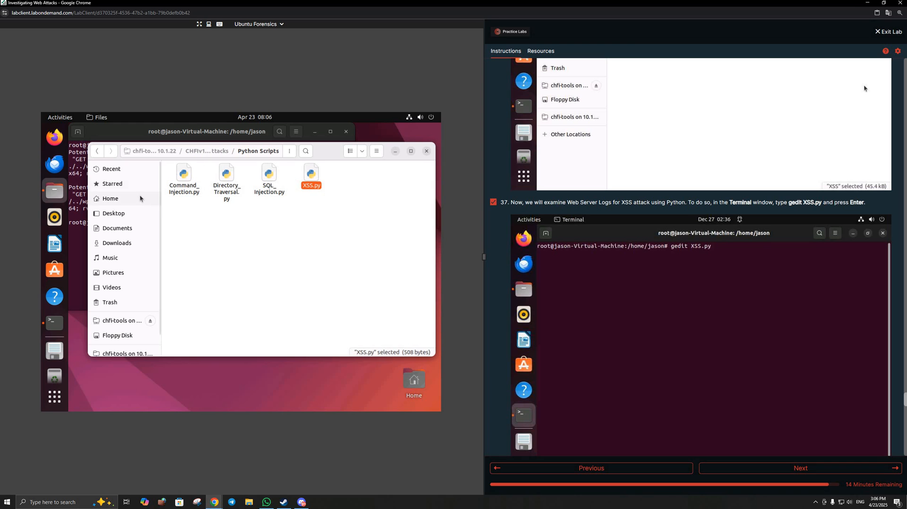

### What I practiced

- Detecting traversal patterns programmatically
- Parsing source IPs and requests from web logs
- Using scripts to automate repetitive forensic log review

---

## 10. XSS Log Parsing with Python

The final recorded Python exercise analyzed XSS-related web logs.

The script output identified possible XSS attempts containing encoded script payloads.

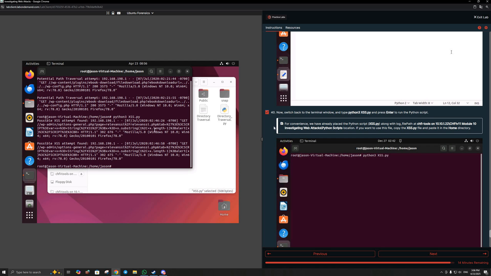

### What I practiced

- Detecting XSS patterns using Python
- Recognizing URL-encoded script content
- Comparing script-based detection with earlier Splunk analysis

---

## Key Takeaways

This module demonstrated two complementary approaches to investigating web attacks:

### SIEM-Based Analysis

Splunk made it possible to:

- Ingest multiple log formats
- Search large collections of events
- Filter attack indicators
- Review event timelines
- Correlate hosts, IP addresses, requests, and status codes

### Script-Based Analysis

Python scripts demonstrated how investigators can:

- Automate repetitive searches
- Parse attack-specific patterns
- Quickly identify suspicious log entries
- Build lightweight custom forensic-analysis workflows

### Attack Indicators Covered

The recording gave me hands-on exposure to identifying evidence of:

- XSS
- SQL Injection
- Directory Traversal
- Command Injection
- XXE
- Brute-Force attacks
