# Network Forensics — Lab Walkthrough

> **Environment:** Authorized academic lab  
> **Module:** Network Forensics  
> **Purpose:** Educational network-forensics investigation and traffic analysis

This walkthrough follows the activities visible in my recorded lab session. It covers Splunk-based FTP brute-force investigation, Wireshark packet analysis, SSH authentication-log analysis, and a Python/PyShark packet-capture exercise.

---

## 1. Investigating an FTP Brute-Force Attack with Splunk

The first section used **Splunk Enterprise** to examine network evidence related to an FTP brute-force attack.

I imported the provided FTP brute-force dataset into Splunk and configured the input settings for analysis.

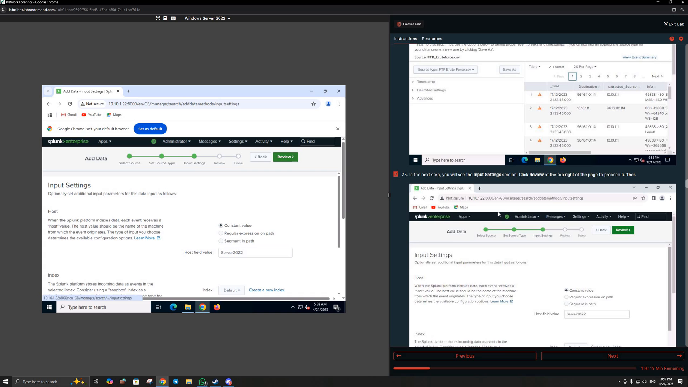

I then searched the indexed events for FTP authentication responses.

A successful FTP login event was identified using the response indicating that the user had logged in.

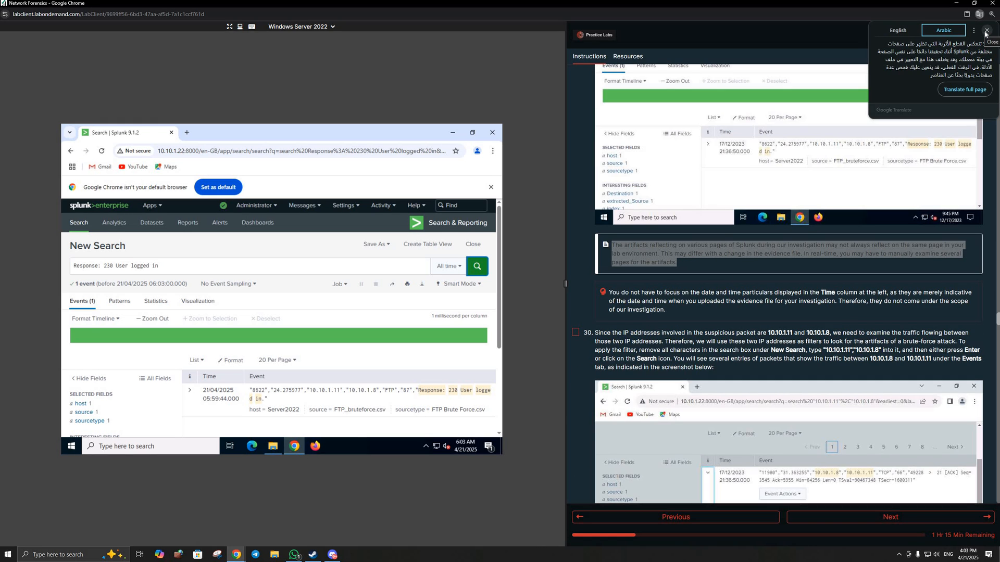

The investigation also examined failed authentication events, including the FTP response indicating that the user could not log in.

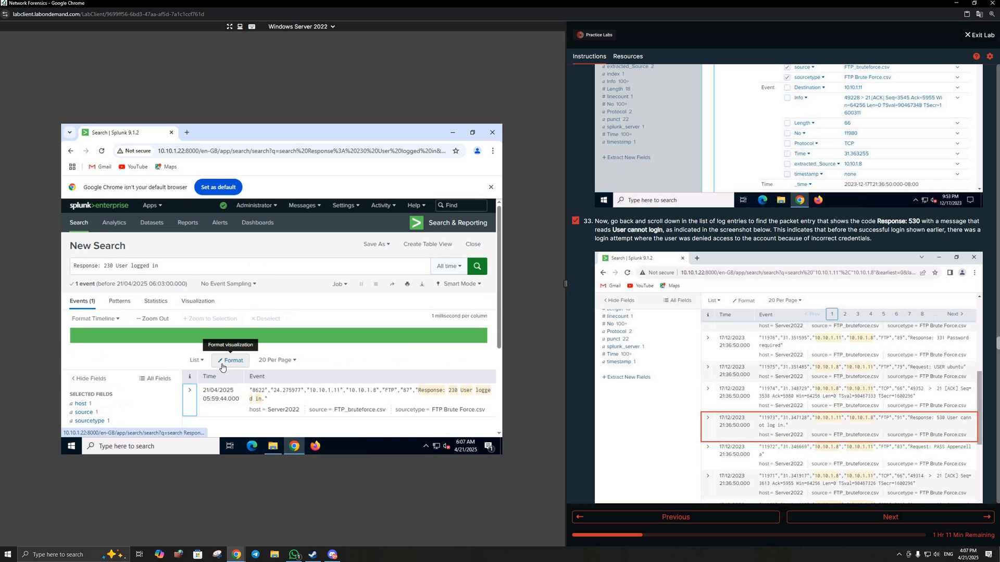

The search results showed a large volume of failed-login events between the relevant systems, supporting the brute-force investigation.

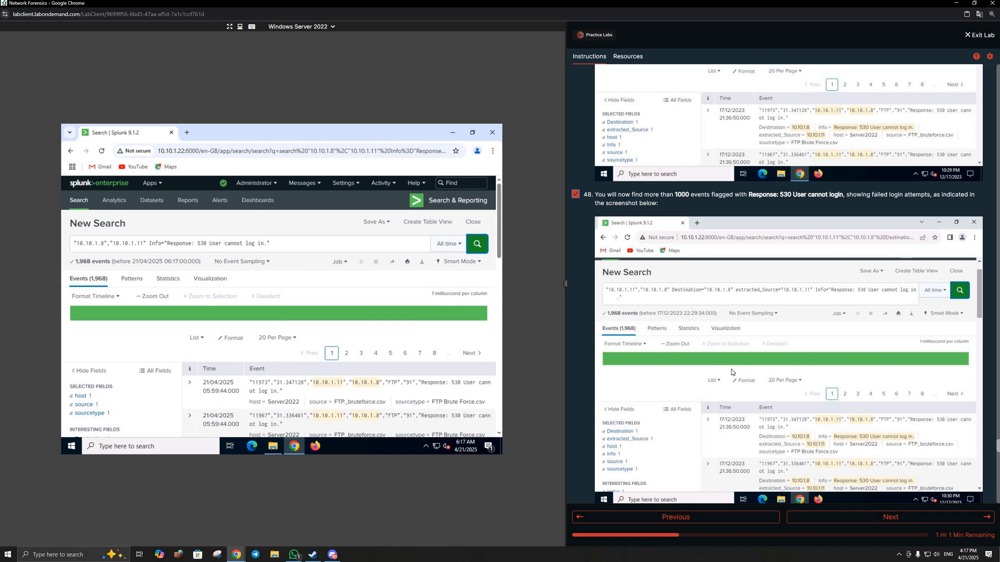

### What I practiced

- Importing network evidence into Splunk
- Searching and filtering events
- Identifying successful and failed FTP authentication
- Correlating source and destination systems
- Using event volume and sequence to investigate brute-force activity

---

## 2. Packet-Capture Analysis with Wireshark

The next recorded section used **Wireshark** to examine several packet-capture files related to network attacks.

### Remote-Shell Traffic

I followed a TCP stream from a DNS Remote Shell packet capture. The reconstructed stream exposed command-line activity from the remote system, demonstrating how packet captures can reveal application-layer evidence.

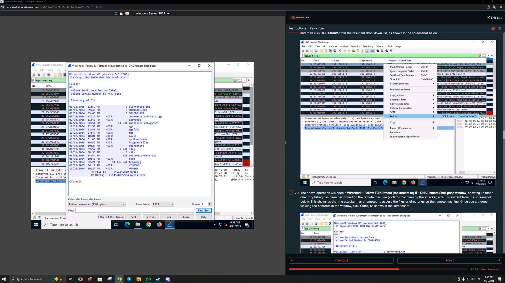

### FTP Brute-Force Evidence

I filtered the FTP brute-force packet capture for the successful FTP response and identified the packet showing a successful login.

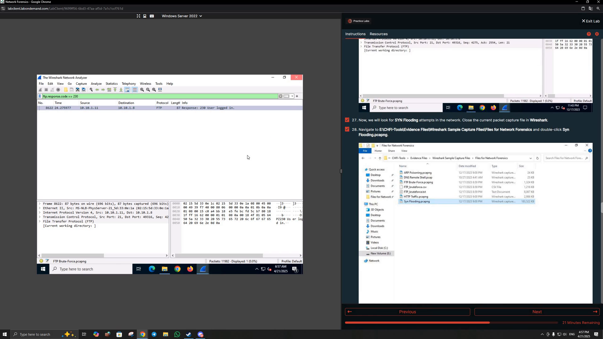

### SYN-Flood Analysis

I reviewed a SYN-flood packet capture and examined the repeated TCP SYN traffic associated with the attack pattern.

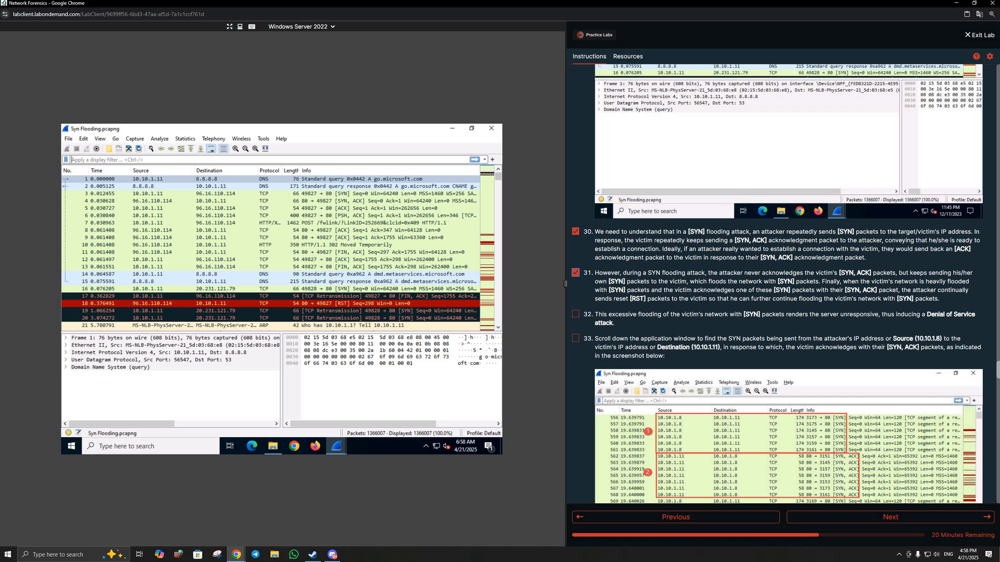

The recording also shows the repeated reset/response pattern used to help distinguish the flooding behavior.

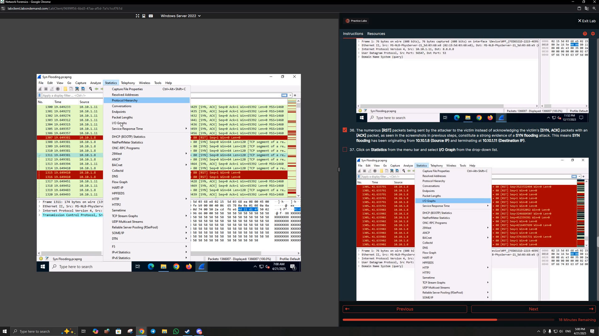

### ARP-Poisoning Indicators

Another packet capture focused on ARP poisoning. Wireshark highlighted duplicate-IP behavior in the ARP traffic, which is a useful indicator when investigating ARP-spoofing activity.

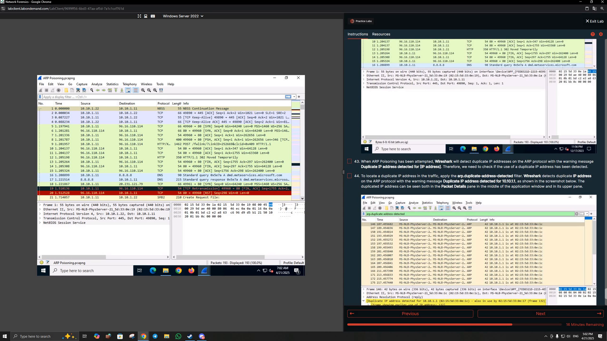

### What I practiced

- Opening and filtering packet-capture files
- Following TCP streams
- Reconstructing remote-shell activity
- Identifying successful FTP authentication in packet data
- Recognizing SYN-flood traffic patterns
- Identifying duplicate-IP/ARP-poisoning indicators
- Using protocol-level evidence to investigate network attacks

---

## 3. Analyzing SSH Logs

The recording then moves to **Lab 4: Analyze SSH Logs**.

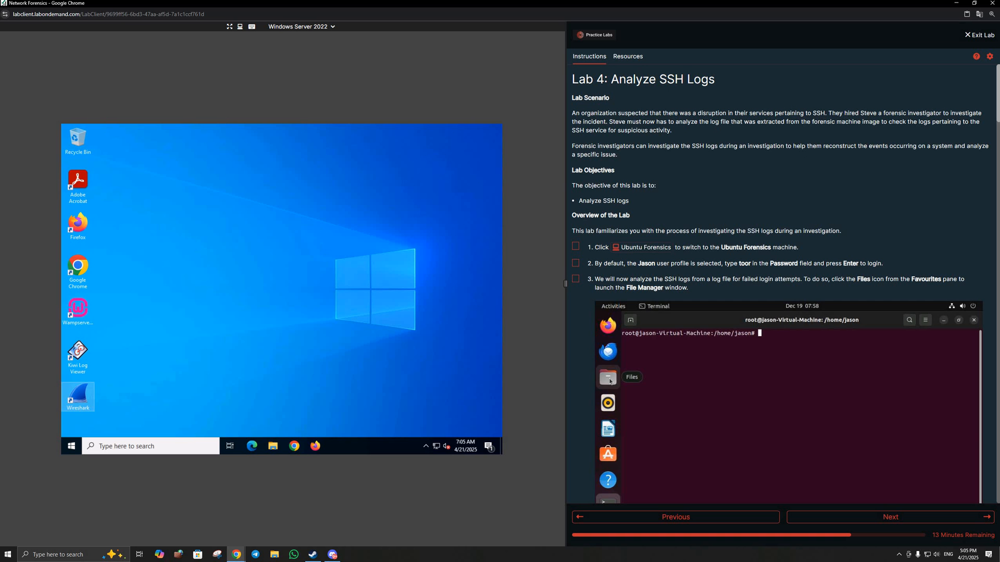

On the Ubuntu Forensics system, I worked with a saved `auth.log` file and used command-line tools to investigate SSH authentication activity.

I filtered the log for failed SSH password attempts.

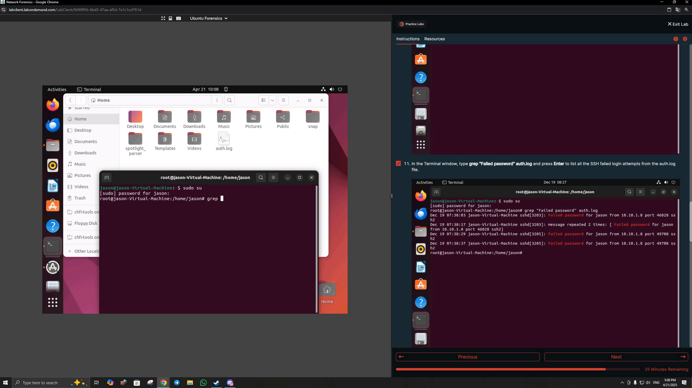

I also used command-line processing to identify and count source IP addresses associated with failed login activity.

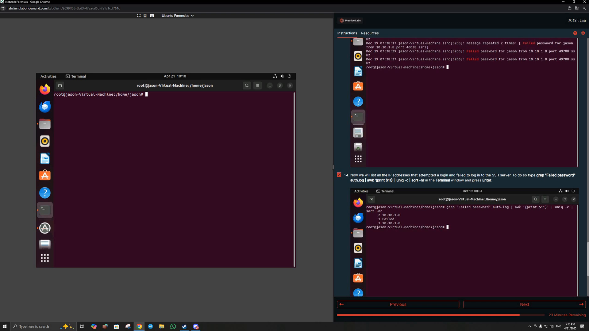

### What I practiced

- Reviewing Linux SSH authentication logs
- Filtering failed-login events with `grep`
- Extracting fields with `awk`
- Counting and sorting repeated values with `uniq` and `sort`
- Identifying source IP addresses associated with suspicious authentication activity

---

## 4. Capturing and Analyzing Raw Packets with Python

The final recorded section is **Lab 5: Capture and Analyze Raw Packets Using Python**.

The exercise used a small Python script with **PyShark** to create a live packet capture and print packet details.

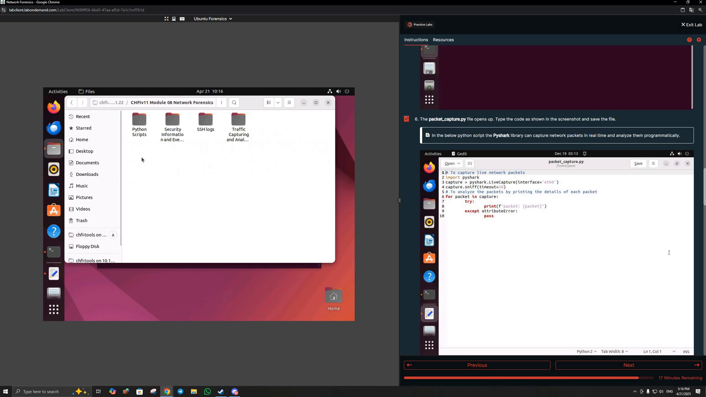

When I first executed the script, the environment returned:

`ModuleNotFoundError: No module named 'pyshark'`

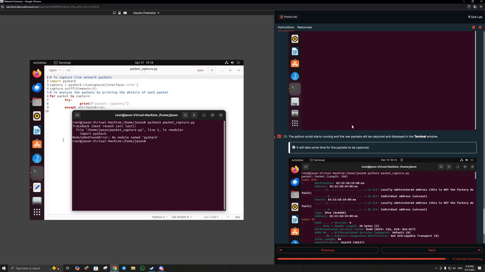

The recording then shows a retry of the script after troubleshooting the environment.

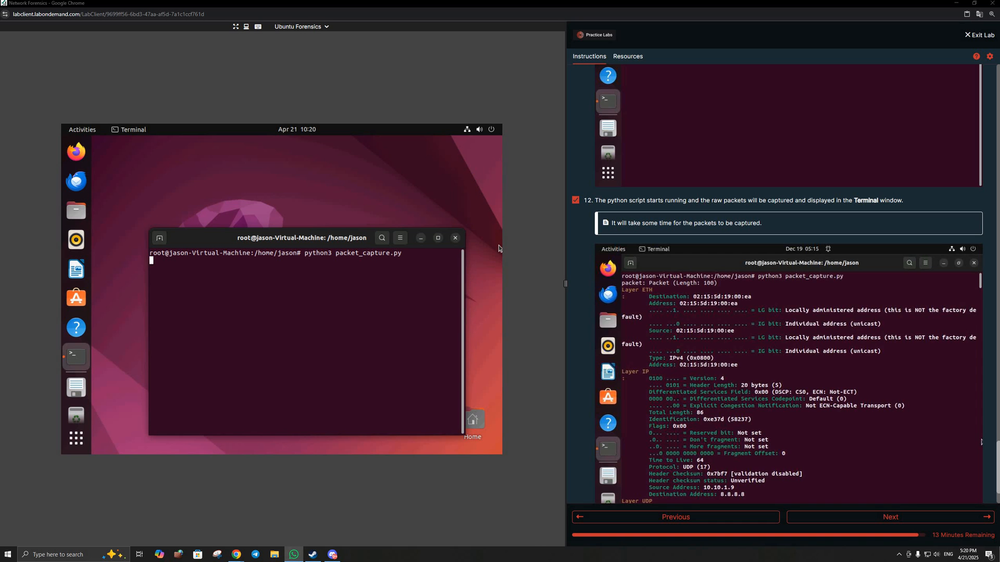

### What I practiced

- Writing a basic network-capture script in Python
- Understanding PyShark as a Python interface to packet-analysis capabilities
- Working with a live-capture object
- Troubleshooting a missing Python dependency
