# Windows Forensics — Lab Walkthrough

> **Environment:** Authorized academic lab  
> **Module:** Windows Forensics  
> **Purpose:** Educational Windows forensic investigation and artifact analysis

This walkthrough documents the activities visible in my recorded Windows Forensics lab session. The recording includes live-system artifact collection, memory analysis, browser-artifact examination, process/DLL review, and Windows event-log analysis.

---

## 1. Live Windows Artifact Review

The early part of the lab focused on collecting and reviewing volatile/live Windows information.

Using **NetworkOpenedFiles**, I reviewed files that were currently open on the Windows system and inspected the properties of a lab-provided suspicious file.

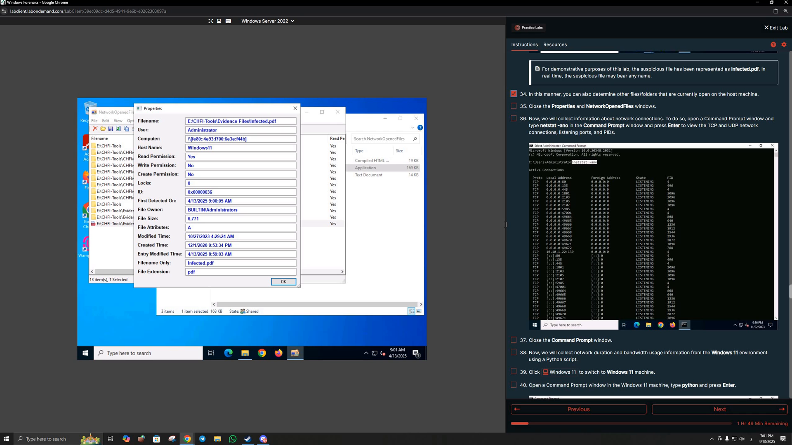

### What I practiced

- Reviewing files currently opened on a Windows host
- Inspecting file, user, host, permission, and timestamp information
- Understanding how live-system artifacts can support an investigation
- Relating open-file activity to other volatile evidence such as active network connections

---

## 2. Memory Analysis with Redline

The lab then used **Redline** to analyze a Windows RAM image.

I reviewed the processes recorded in the memory image.

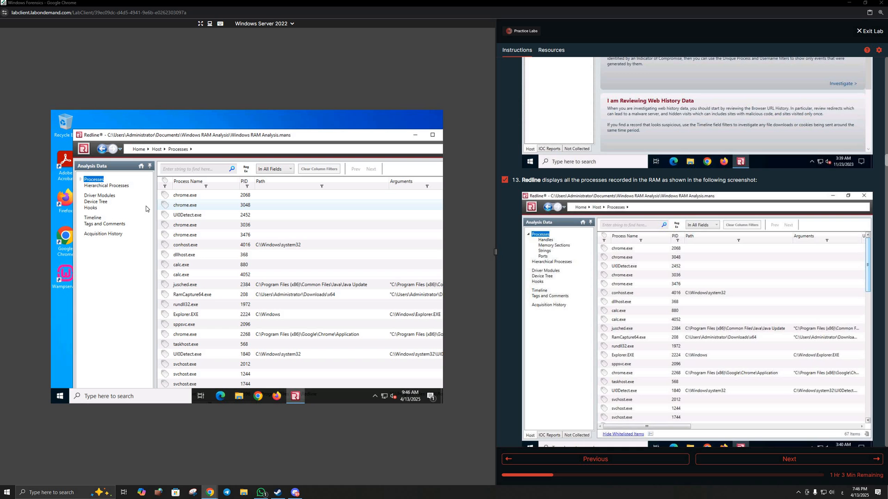

I also examined the **Hierarchical Processes** view to understand parent/child relationships between processes.

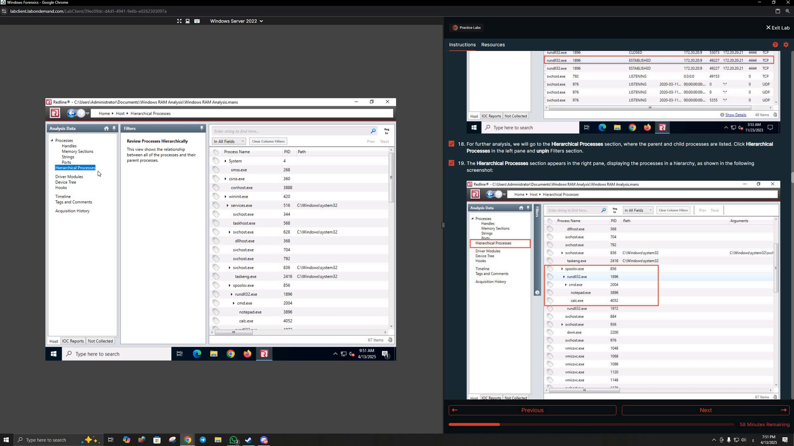

### What I practiced

- Loading and reviewing memory-analysis results
- Identifying running processes captured in RAM
- Examining parent/child process relationships
- Looking for process behavior that may require further investigation

---

## 3. Memory Analysis with Volatility

The recording also demonstrates memory analysis using the **Volatility Framework**.

I first used image profiling/information output to identify details about the Windows memory image and select an appropriate profile.

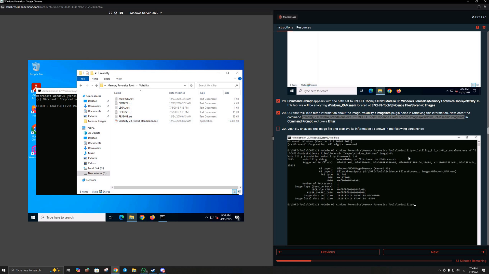

I then reviewed network connections present in the memory image.

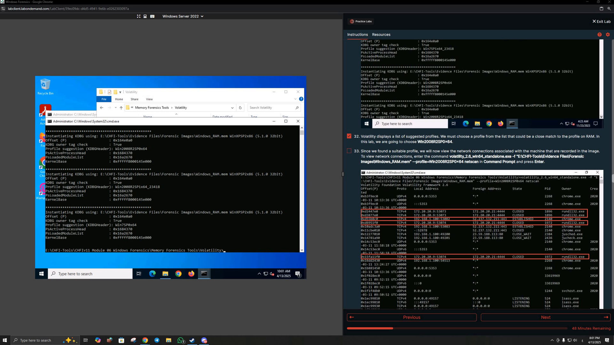

Process output was also examined to understand process relationships and identify processes of interest.

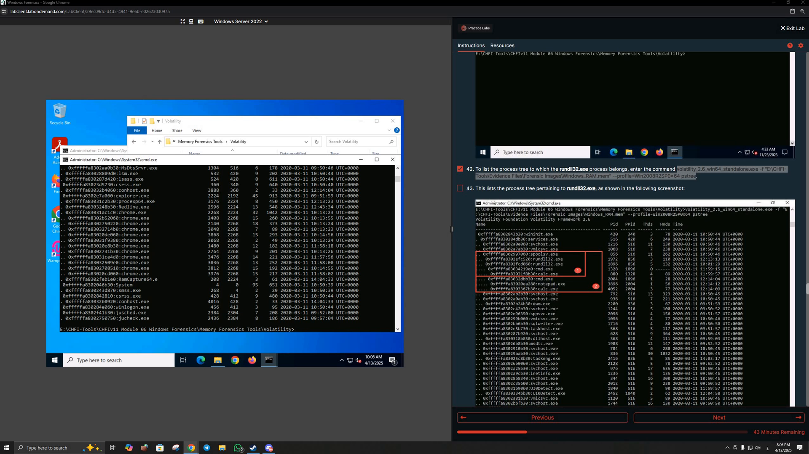

### What I practiced

- Profiling a memory image
- Reviewing processes from memory
- Examining network activity preserved in RAM
- Correlating process and network evidence
- Using memory artifacts to reconstruct system activity

---

## 4. Extracting Indicators from Memory

On the Ubuntu Forensics workstation, I used **strings** against the Windows RAM image and filtered the output to identify artifacts such as URLs and IP-style values.

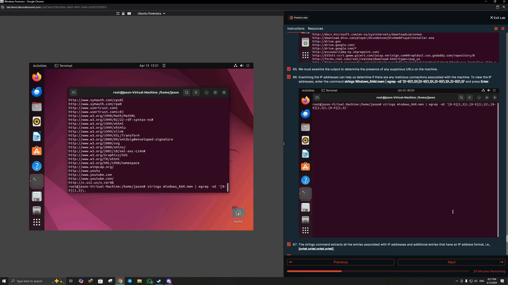

### What I practiced

- Extracting human-readable strings from a memory image
- Filtering large output for indicators
- Identifying URLs and network-related strings
- Using simple command-line techniques to support memory triage

---

## 5. Exploring Memory with MemProcFS

The lab also introduced **MemProcFS**, which exposes memory-analysis results through a filesystem-style interface.

After loading the memory image, I browsed the mounted MemProcFS drive and reviewed the generated forensic directories and files.

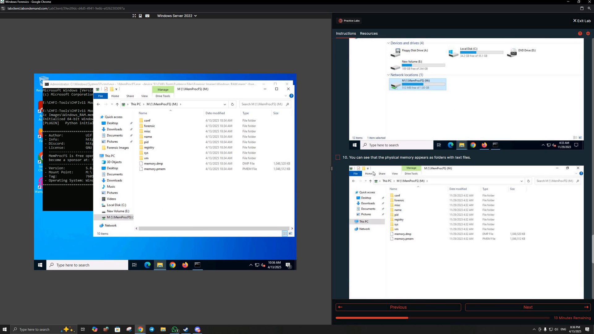

### What I practiced

- Mounting a memory image through MemProcFS
- Navigating memory artifacts through a filesystem-style interface
- Reviewing process, registry, forensic, and system artifacts generated from RAM
- Understanding an alternative workflow for memory forensics

---

## 6. Registry and Evidence Artifacts with FTK Imager

Another section used **AccessData FTK Imager** to work with Windows evidence and registry-related artifacts.

I navigated evidence content and prepared extracted registry/evidence data for further analysis.

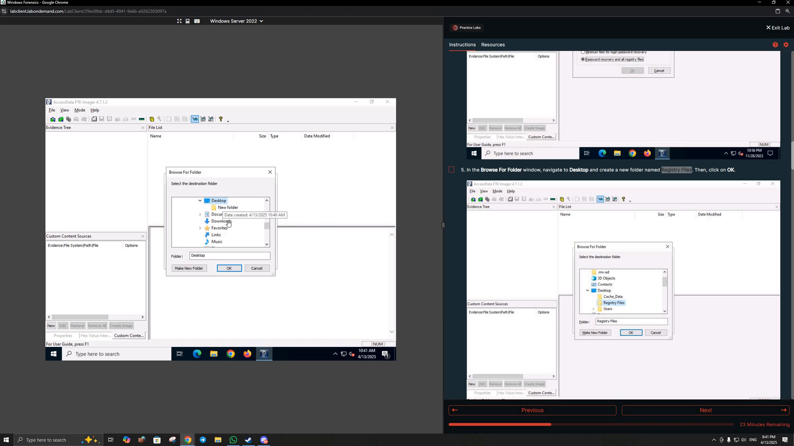

### What I practiced

- Navigating Windows forensic evidence in FTK Imager
- Locating registry-related artifacts
- Extracting evidence for analysis with specialized tools
- Preserving a structured workflow between evidence acquisition and artifact analysis

---

## 7. Web Browser Artifact Examination

The recording explicitly includes **Lab 5: Examine Web Browser Artifacts**.

The objective was to investigate browser artifacts such as browsing history, cookies, and cache from browsers including Google Chrome and Mozilla Firefox.

### MZHistoryView

I used **MZHistoryView** to load and review a Mozilla Firefox history database.

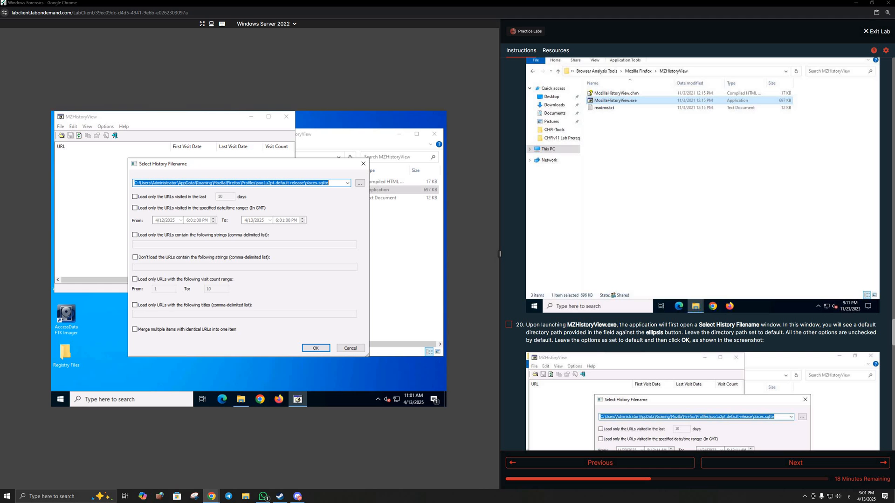

### Browser History Extraction with FTK Imager

I located browser profile artifacts inside the forensic evidence and examined the Chrome **History** database.

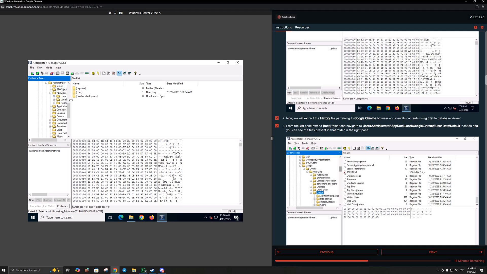

### SQLite Artifact Analysis

I opened browser data in **SysTools SQLite Viewer** and reviewed stored records such as browser keywords/search-related artifacts.

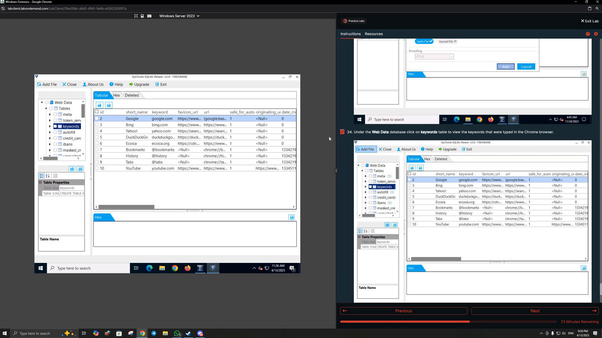

### Browser History Examiner

I also used **Browser History Examiner** to load browser data and review cached web content/history.

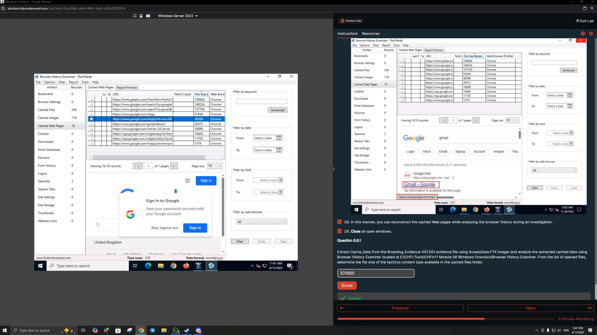

### What I practiced

- Locating browser profile artifacts
- Examining Firefox and Chrome history
- Reviewing cache and browsing records
- Working with browser SQLite databases
- Reconstructing browser activity from forensic artifacts

---

## 8. Process and DLL Analysis

The later part of the lab used **Process Explorer** to inspect active Windows processes and their loaded DLLs.

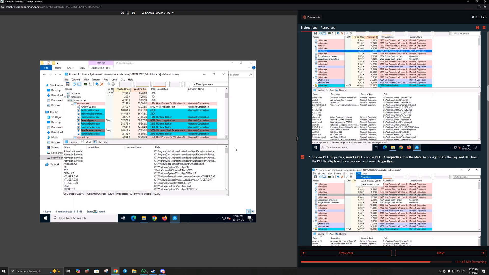

### What I practiced

- Reviewing active Windows processes
- Inspecting loaded DLLs
- Examining file/company/path information
- Identifying DLLs or process components that may require further research

---

## 9. Windows Event Log Analysis

The final recorded section used **Event Log Explorer** to inspect Windows security events.

I reviewed event records, event IDs, sources, timestamps, and event descriptions.

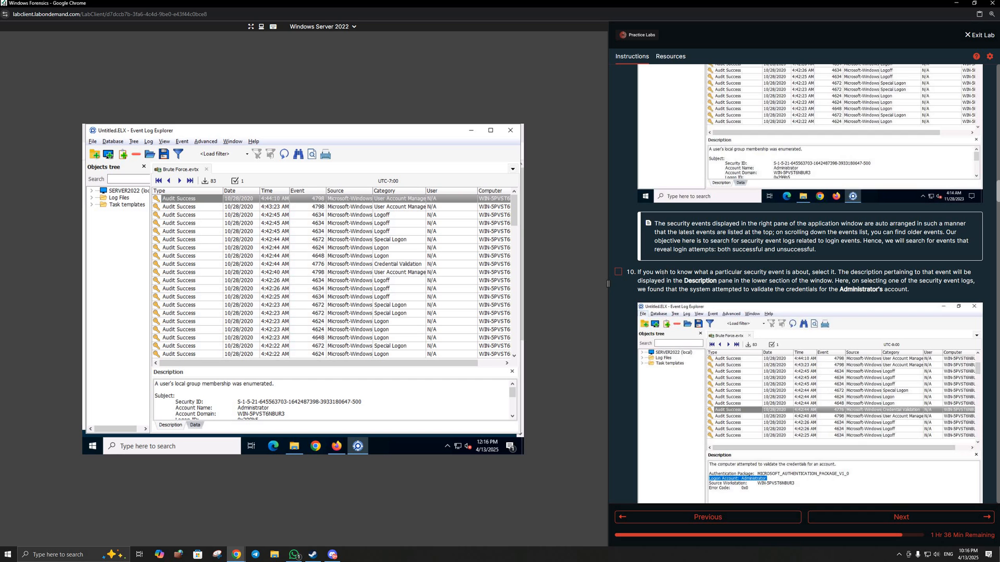

### What I practiced

- Loading and reviewing Windows event logs
- Filtering security events
- Reading event IDs and descriptions
- Investigating logon/account-related events
- Using timestamps and event details to reconstruct activity

---

## Key Takeaways

This module gave me hands-on exposure to multiple Windows forensic evidence sources:

- Live host artifacts
- Open-file evidence
- RAM/memory images
- Processes and network connections
- URLs and indicators preserved in memory
- Windows registry-related evidence
- Browser history, cache, and SQLite databases
- Process/DLL information
- Windows security event logs

The lab also demonstrated the value of correlating evidence from several tools rather than relying on a single artifact source.
