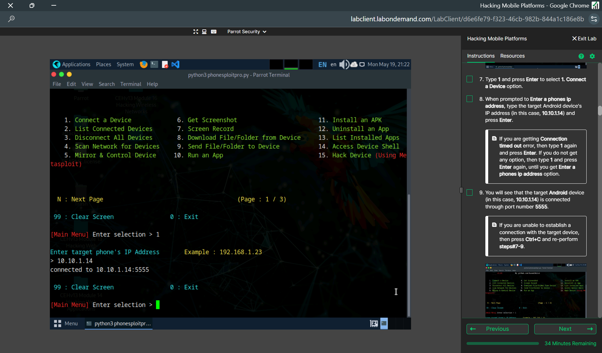
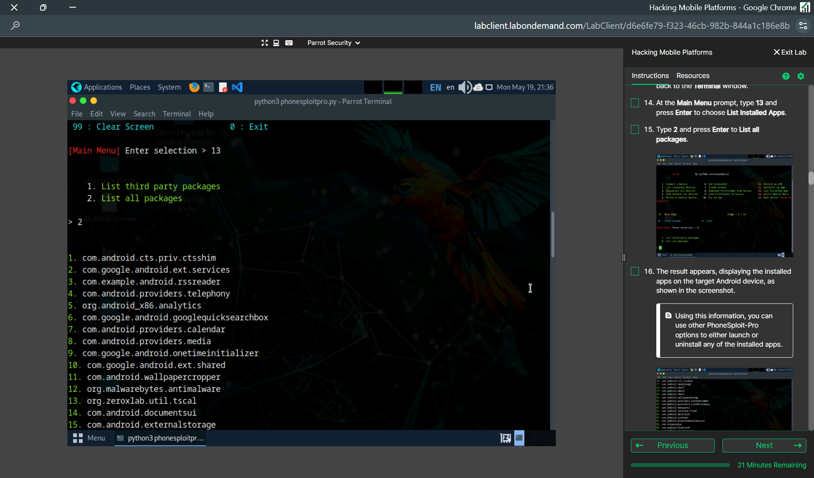
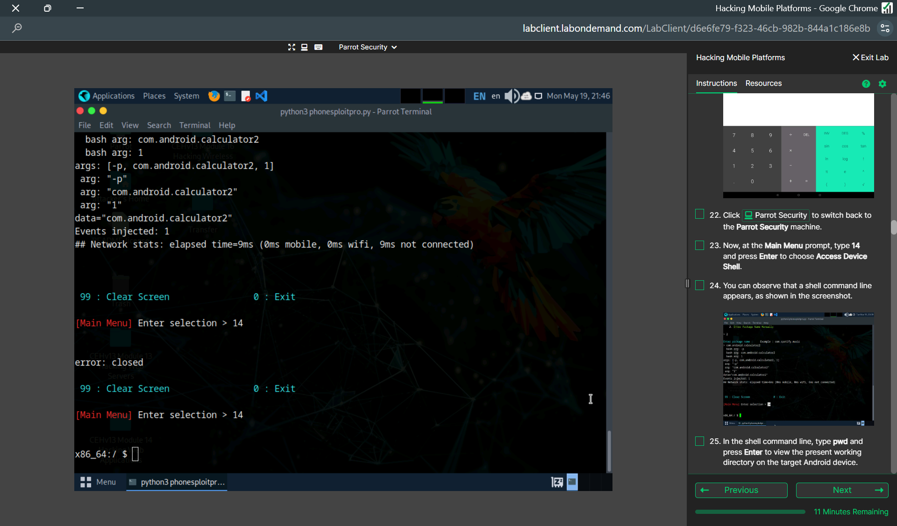
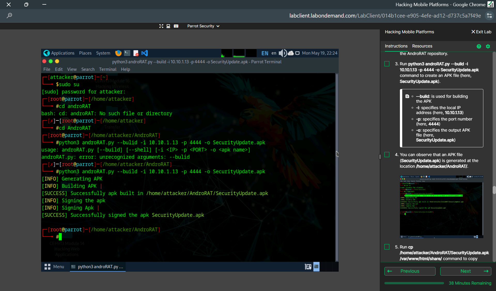
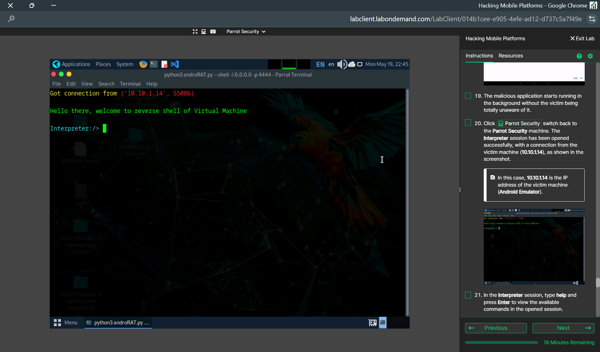
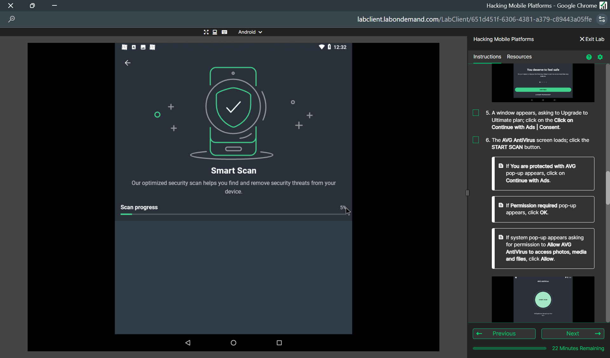

# Android Security Lab Walkthrough

> **Environment:** Authorized academic lab  
> **Purpose:** Educational mobile-security testing and defensive analysis only

## Lab Overview

This walkthrough documents the Android security exercises I completed in a controlled academic environment. The lab covered ADB exposure, Android device enumeration, controlled shell access, malicious APK behavior using AndroRAT, and mobile threat detection using AVG AntiVirus.

To keep this public portfolio focused and responsible, unnecessary credentials, private data, and sensitive extraction output are not included.

---

## 1. Connecting to an Android Device through ADB

The first part of the lab focused on understanding the risk created when Android Debug Bridge (ADB) is exposed or improperly secured.

Using **PhoneSploit-Pro** from the Parrot Security lab machine, I connected to the authorized Android target through the lab's ADB service.

### What I learned

- ADB is a powerful administrative and debugging interface
- Exposed ADB access can allow unauthorized interaction with a device
- Debugging services should not be unnecessarily exposed to networks
- Access to development interfaces should be restricted and authenticated

---

## 2. Android Package Enumeration

After establishing the authorized lab connection, I used PhoneSploit-Pro to enumerate applications installed on the Android device.

Package enumeration demonstrated how device information can be collected after access is obtained.

### Security impact

Application enumeration may reveal:

- Installed user applications
- System packages
- Security software
- Potentially interesting applications for further analysis

---

## 3. Shell-Level Access

The lab also demonstrated shell-level interaction with the Android device.

This helped me understand the level of control that may become available when a mobile device exposes an insecure administrative interface.

### What I learned

- Shell access can significantly increase the impact of a compromised device
- Internal files and device configuration may become accessible
- Mobile devices should restrict debugging and administrative interfaces
- Strong device configuration is an important part of endpoint security

---

## 4. Understanding Malicious APK Risks with AndroRAT

The next part of the lab used **AndroRAT** in the controlled environment to study how a malicious Android application can create remote-access risk.

A lab APK was generated specifically for the authorized exercise.

The exercise demonstrated the relationship between a malicious application, a remote listener, and an established session.

After the APK was installed in the controlled Android environment, a remote session was observed from the Parrot Security lab machine.

### What I learned

- Untrusted APK files can introduce remote-access capabilities
- Social engineering and unsafe application installation are major mobile-security risks
- Remote-access malware can expose device information and user data
- Application-source verification and permission review are important defensive controls

For this public portfolio, I intentionally excluded screenshots showing message extraction, credentials, or unnecessary sensitive lab data.

---

## 5. Mobile Threat Detection with AVG AntiVirus

The defensive portion of the lab focused on scanning the Android environment for potentially malicious applications and security issues using **AVG AntiVirus**.

This portion of the lab demonstrated the role of mobile endpoint security tools in identifying potentially harmful applications.

### What I learned

- Mobile security applications can scan installed files and applications
- Endpoint tools complement, but do not replace, secure device configuration
- Users should avoid installing applications from untrusted sources
- Security updates and application permissions should be regularly reviewed

---

## Security Recommendations

Based on the exercises in this lab, useful Android security controls include:

- Disable ADB when it is not required
- Do not expose debugging interfaces to untrusted networks
- Install applications only from trusted sources
- Review application permissions before installation
- Keep Android and installed applications updated
- Use endpoint/mobile security tools where appropriate
- Apply strong authentication and device-lock controls
- Avoid enabling unnecessary developer options on production devices

---

## Key Takeaways

Through this lab, I gained hands-on exposure to:

- Android Debug Bridge (ADB) security
- Android device and package enumeration
- Mobile shell access
- Remote-access malware concepts
- Malicious APK risks
- Mobile endpoint protection
- Android hardening and defensive controls
- Parrot Security and Android security tooling
