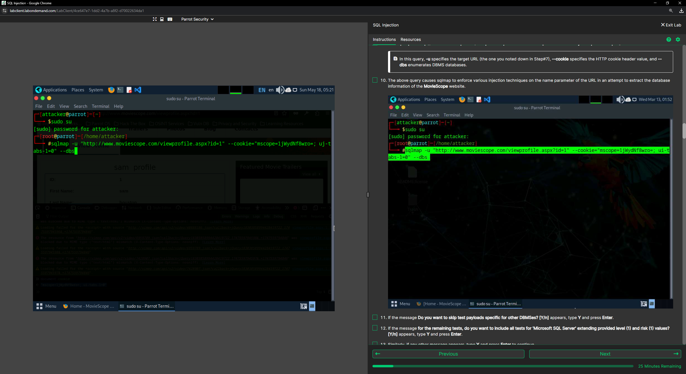
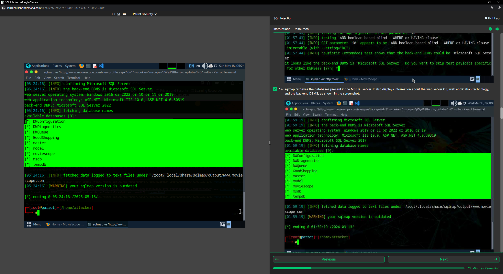
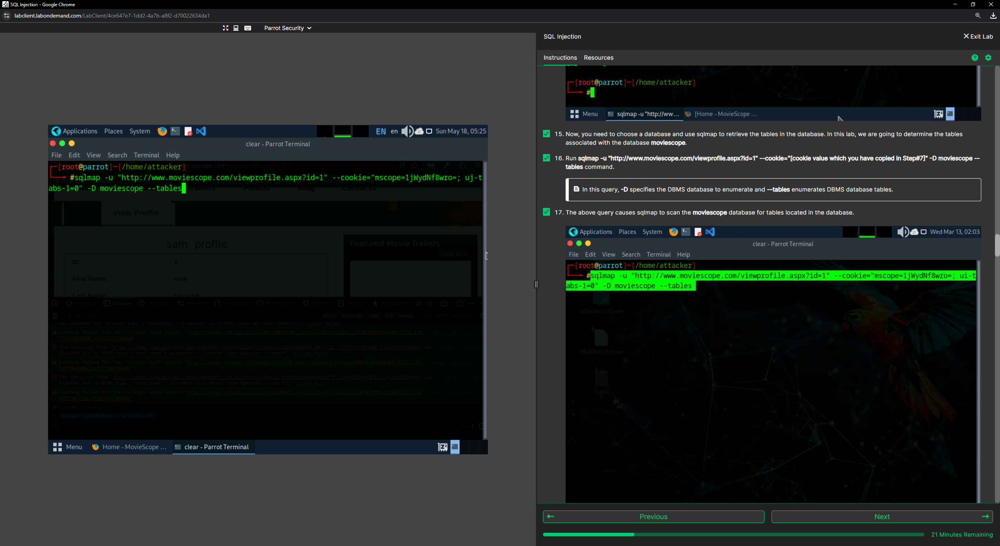
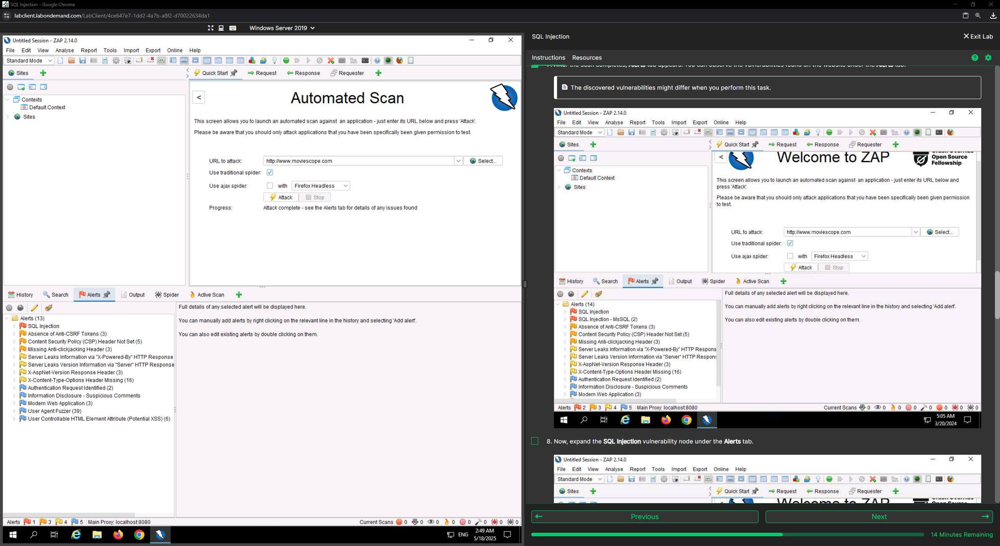
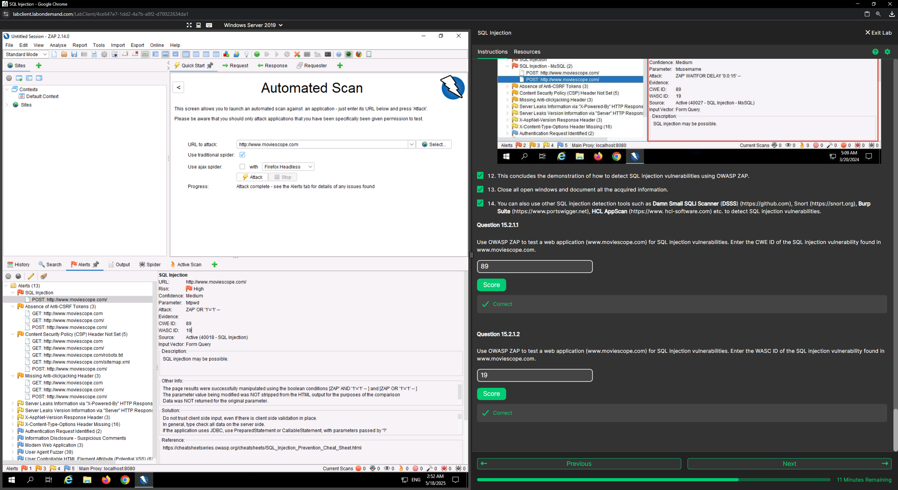
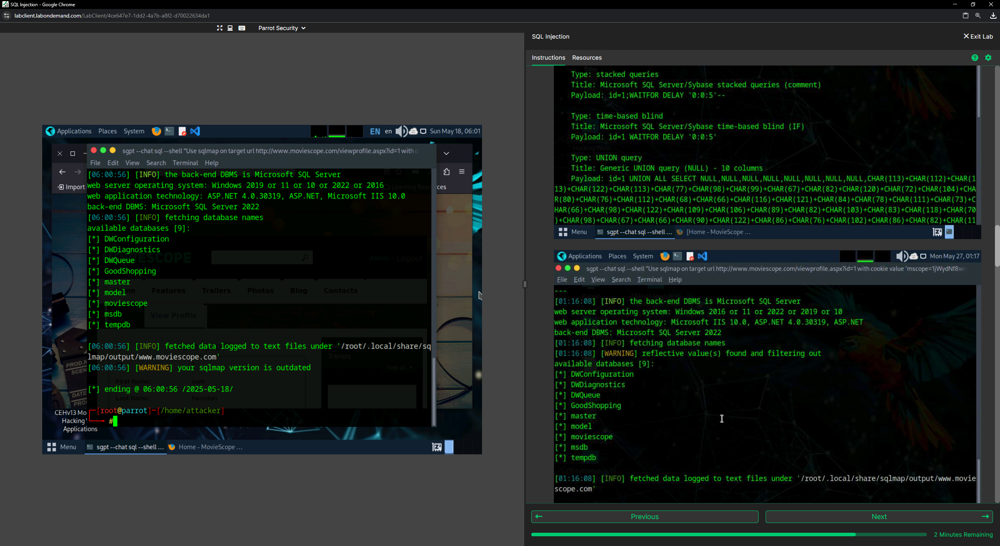

# SQL Injection Lab Walkthrough

> **Environment:** Authorized academic lab  
> **Purpose:** Educational vulnerability testing and security analysis only

## Lab Overview

This walkthrough documents the practical SQL injection exercises I completed in a controlled academic environment. The lab covered manual preparation for SQL injection testing, database enumeration with SQLmap, vulnerability detection with OWASP ZAP, and AI-assisted testing with ShellGPT.

To keep this repository appropriate for a public portfolio, lab credentials and sensitive extracted data are intentionally not included.

---

## 1. Preparing the Web Application Session

I first logged in to the intentionally vulnerable web application provided in the lab environment.

I then used the browser developer tools to inspect the active session and retrieve the session information required for authenticated security testing.

This step helped me understand why session context can be important when testing authenticated areas of a web application.

---

## 2. Database Enumeration with SQLmap

After obtaining the required session information, I used **SQLmap** against the authorized lab target to test for SQL injection and enumerate the available databases.

The SQLmap output showed that database information could be retrieved through the vulnerable application.

### What I learned

- How SQLmap automates SQL injection testing
- How authenticated session information can be used during authorized testing
- How a successful SQL injection vulnerability can expose database structure
- Why database-backed applications require secure query handling

---

## 3. Table Enumeration

After identifying the target database, I continued the assessment by enumerating its tables.

This demonstrated how an SQL injection vulnerability can allow an attacker to move from identifying a vulnerable parameter to understanding the internal database structure.

### Security impact

Successful database enumeration can reveal:

- Application database names
- Table names
- Database structure
- Potential locations of sensitive information

For a public portfolio, I have intentionally excluded screenshots containing extracted credentials or sensitive lab data.

---

## 4. SQL Injection Detection with OWASP ZAP

The second part of the lab focused on **detecting** SQL injection vulnerabilities rather than exploiting them.

I opened **OWASP ZAP** on the Windows Server 2019 lab machine and used its automated scanning functionality against the authorized target application.

After the scan completed, ZAP reported security findings in the application.

I reviewed the vulnerability information provided by ZAP, including security classification references such as **CWE** and **WASC** identifiers.

### What I learned

- How automated web vulnerability scanners identify potential weaknesses
- How OWASP ZAP presents vulnerability findings
- How CWE and WASC identifiers help classify security issues
- The difference between vulnerability detection and exploitation

---

## 5. AI-Assisted SQL Injection Testing

The final part of the lab introduced **ShellGPT** as an AI-assisted tool for security testing in the same controlled environment.

I used it to assist with the SQL injection workflow and database enumeration.

This exercise demonstrated how AI-assisted tools can help automate or accelerate parts of a penetration-testing workflow while still requiring the tester to understand the target, the vulnerability, and the resulting output.

### What I learned

- AI tools can assist with repetitive security-testing tasks
- Tool output still requires technical validation
- Automation does not replace understanding of SQL injection concepts
- Security testing should always remain within authorized environments

---

## Key Takeaways

Through this lab, I gained hands-on experience with:

- SQL injection concepts and impact
- SQLmap
- Database and table enumeration
- Authenticated web application testing
- OWASP ZAP
- Vulnerability classification using CWE and WASC
- AI-assisted security testing with ShellGPT
- Reviewing security findings and understanding their potential impact

---

## Recommended Mitigations

Common controls that help reduce SQL injection risk include:

- Parameterized queries / prepared statements
- Strong server-side input validation
- Least-privilege database accounts
- Secure error handling
- Regular web application security testing
- Keeping frameworks and dependencies updated
