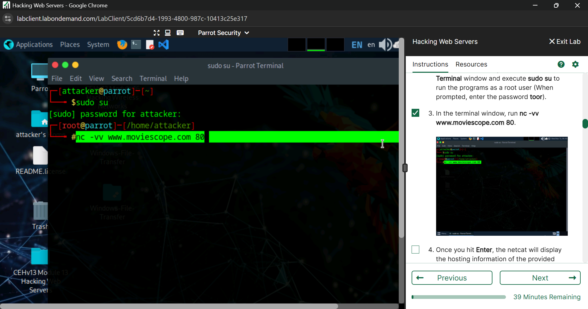
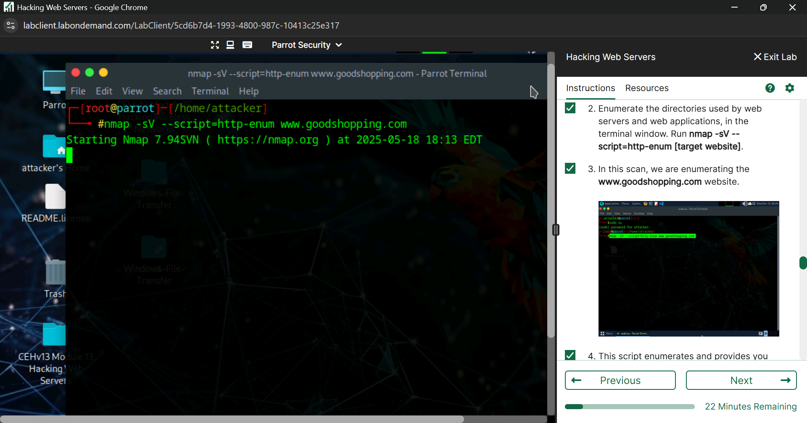
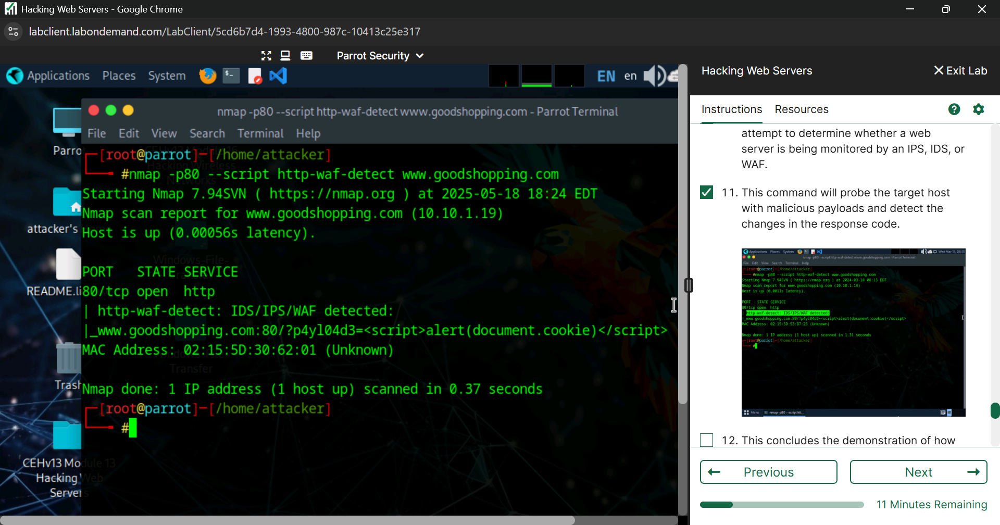
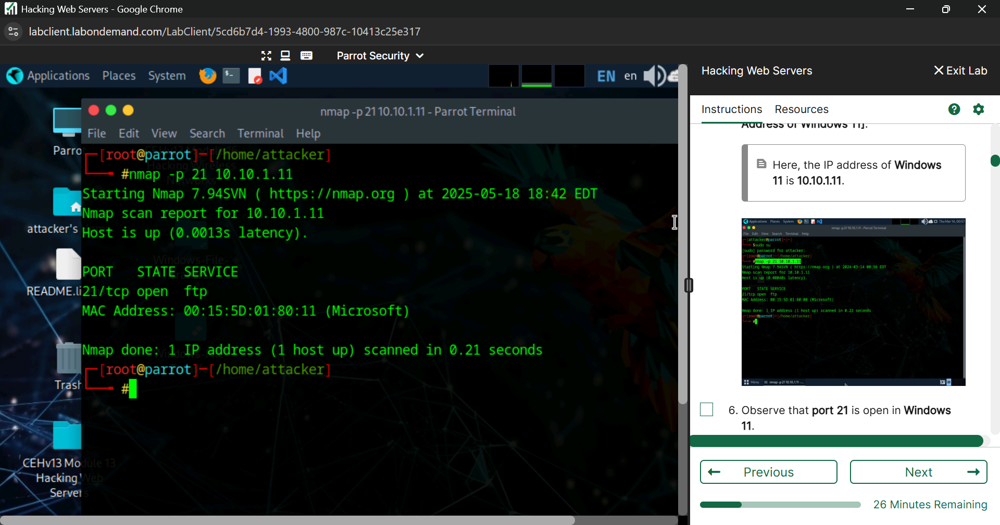
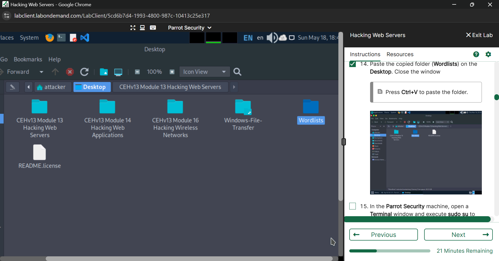
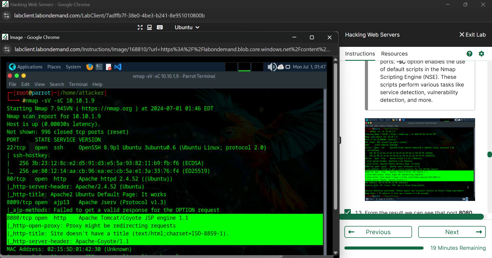
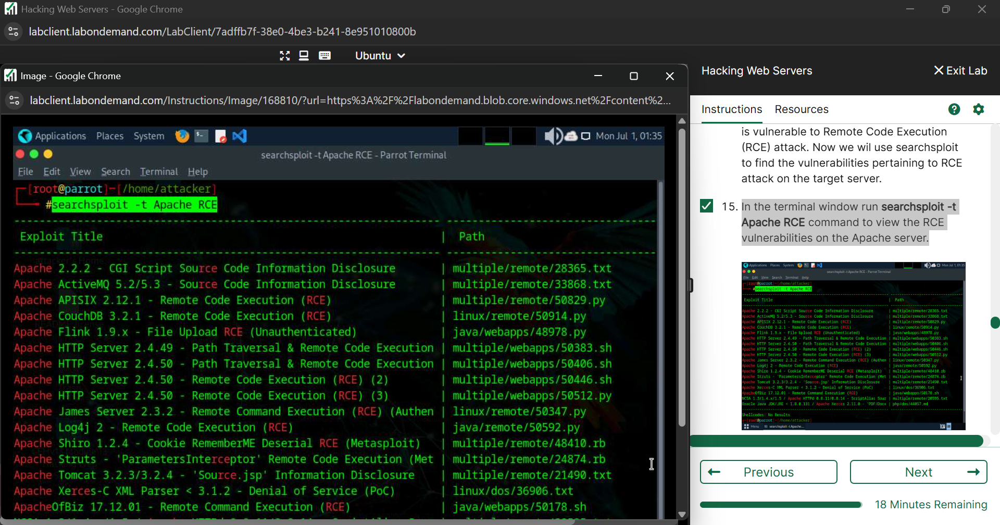
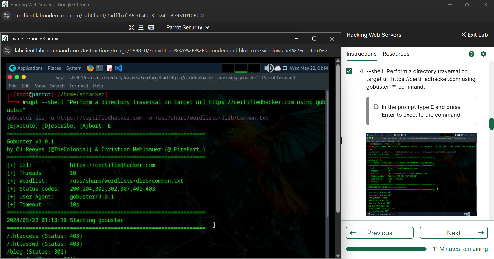

# Web Server Security Lab Walkthrough

> **Environment:** Authorized academic lab  
> **Purpose:** Educational web-server security testing and defensive analysis only

## Lab Overview

This walkthrough documents the web server security exercises I completed in a controlled academic environment. The lab covered banner grabbing, web-service enumeration, WAF detection, FTP security testing, Log4j vulnerability analysis, and AI-assisted security testing.

To keep this public portfolio appropriate, unnecessary credentials and sensitive lab output are intentionally excluded.

---

## 1. Web Server Footprinting with Netcat

The first part of the lab focused on gathering basic information from a web server.

Using **Netcat**, I connected to the authorized lab web server and sent an HTTP request to observe the returned server information and response headers.

### What I learned

- HTTP responses can reveal server and application information
- Banner grabbing is useful during the reconnaissance phase
- Exposed version information can help identify potential weaknesses
- Unnecessary server details should be minimized where possible

---

## 2. Web Server Enumeration with Nmap NSE

I then used the **Nmap Scripting Engine (NSE)** to enumerate web-server information and discover directories and services exposed by the target.

This demonstrated how Nmap can go beyond basic port scanning and automate web-service discovery.

### What I learned

- Nmap NSE can automate common enumeration tasks
- Directory and service discovery can reveal additional attack surface
- Service enumeration helps prioritize further security assessment

---

## 3. Web Application Firewall Detection

The lab also included checking whether a Web Application Firewall (WAF) was present on the authorized target.

### Security relevance

WAF detection helps a tester understand:

- Whether application-layer filtering is present
- How a target may respond to suspicious requests
- Which defensive controls are deployed in front of a web application

A WAF is only one layer of defense and should not replace secure application development and patching.

---

## 4. FTP Service Assessment

The next section focused on an FTP service running in the controlled lab environment.

I first used **Nmap** to confirm that the FTP service was exposed.

The lab then demonstrated a dictionary-based authentication test using **Hydra** against the authorized FTP service.

For this public portfolio, I intentionally excluded screenshots containing cracked credentials.

### What I learned

- Exposed services increase the attack surface of a system
- Weak credentials can undermine otherwise secure services
- Authentication testing should only be performed with explicit authorization
- Strong passwords, lockout controls, and service restrictions reduce credential-based risk

---

## 5. Log4j Vulnerability Analysis

The lab included a controlled environment containing a vulnerable Apache/Java setup for studying the **Log4j remote code execution risk**.

I used Nmap to enumerate the target's running services.

I then used **Searchsploit** to review publicly documented exploit information related to Apache/Java remote code execution.

### What I learned

- Vulnerable third-party dependencies can create critical security exposure
- Service and version enumeration is important for vulnerability identification
- Public vulnerability databases and exploit references can support authorized security research
- Patch management and dependency monitoring are essential defensive controls

---

## 6. AI-Assisted Web Security Testing

The final section introduced **ShellGPT** as an AI-assisted tool in the controlled lab environment.

One exercise used ShellGPT to assist with a directory-discovery workflow using Gobuster.

This demonstrated how AI-assisted tooling can support security workflows, while still requiring the tester to understand the command, target, and resulting output.

### What I learned

- AI tools can accelerate repetitive security-testing tasks
- Generated commands must be reviewed before execution
- Automation does not replace understanding of the underlying technique
- Authorization and scope remain essential regardless of the tool being used

---

## Security Recommendations

Based on the exercises in this lab, useful defensive controls include:

- Minimize unnecessary server banner and version disclosure
- Disable or restrict unused services
- Apply strong authentication and account-lockout policies
- Restrict administrative and remote-access services
- Patch vulnerable frameworks and dependencies promptly
- Monitor software dependencies for known vulnerabilities
- Deploy layered security controls such as WAFs where appropriate
- Monitor logs for suspicious authentication and enumeration activity
- Perform regular vulnerability assessments

---

## Key Takeaways

Through this lab, I gained hands-on exposure to:

- Web server footprinting
- Banner grabbing
- Nmap and Nmap NSE
- WAF detection
- FTP service assessment
- Dictionary-based authentication testing
- Log4j vulnerability analysis
- Searchsploit
- Docker-based vulnerable lab environments
- AI-assisted security testing with ShellGPT
- Web-server hardening concepts
